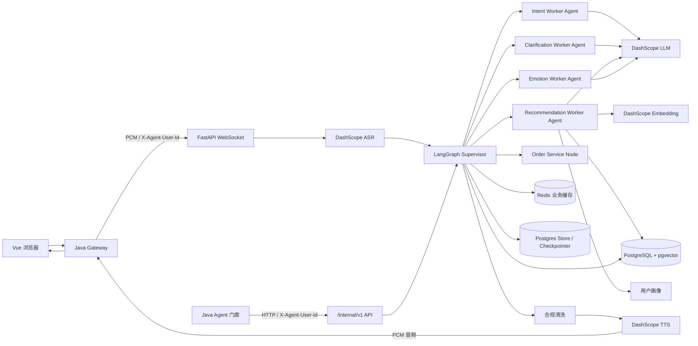
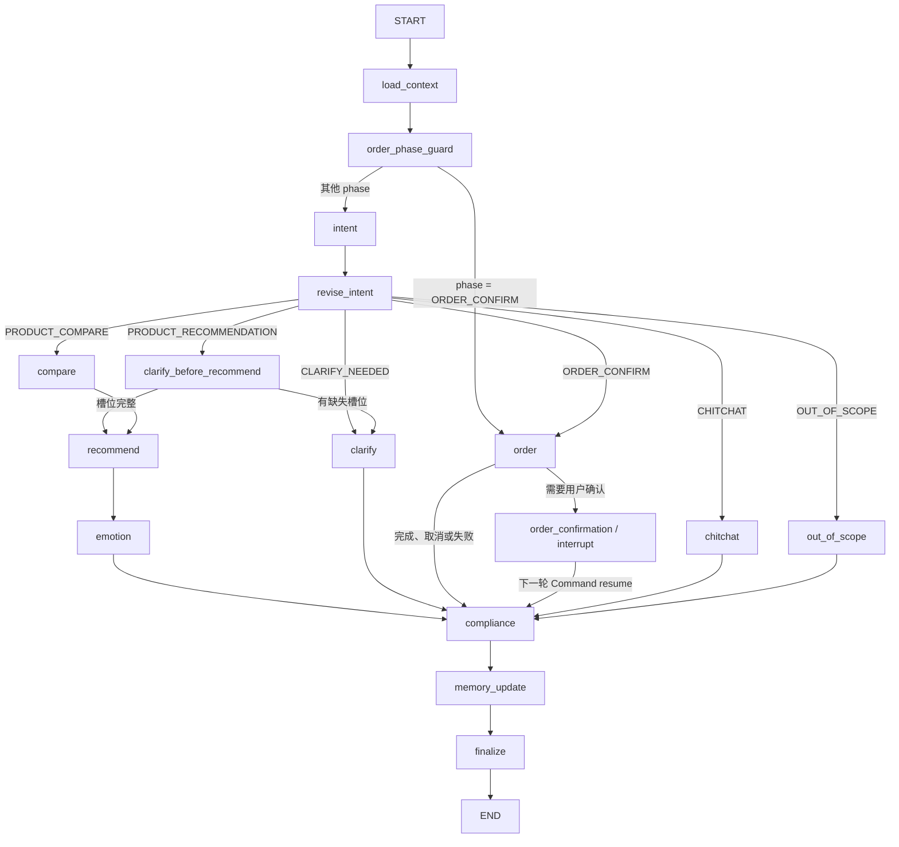
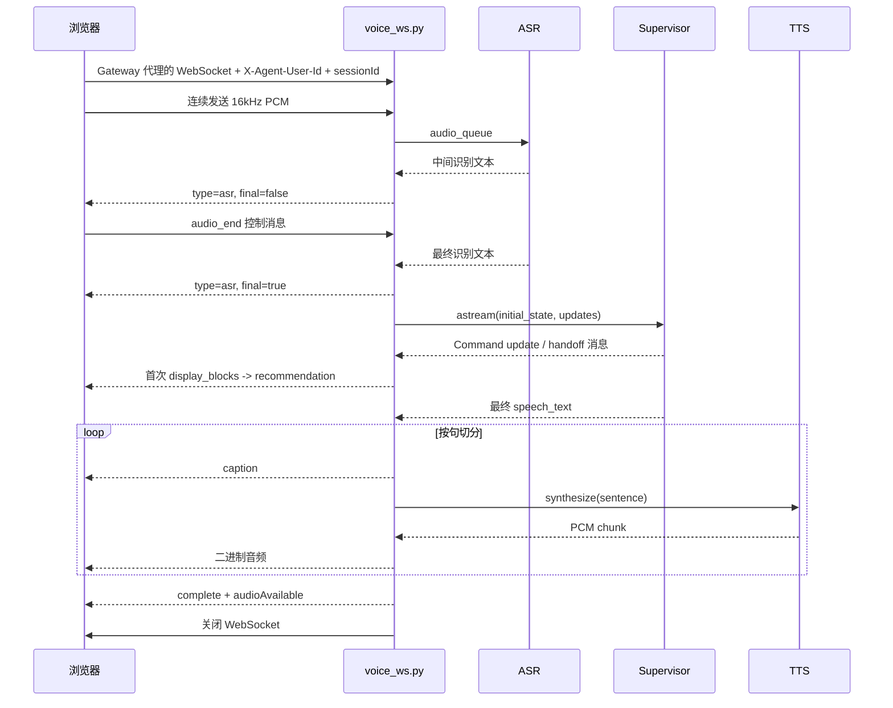

# voice-sale-agent 项目小白完全指南

> 文档已按 2026-09-05 当前代码逐文件核对。它首先服务于第一次接触 Python、FastAPI、LangGraph 和 AI Agent 项目的读者，同时也可用于开发定位、面试复盘和技术债分析。

> 当前版本已接入 PostgreSQL `AsyncPostgresSaver` 与 `AsyncPostgresStore`、稳定 `thread_id`、用户级语义记忆 namespace、消息型 `Command` handoff、Recommendation 有界 ReAct ToolNode 循环，以及订单 `interrupt()/Command(resume=...)`。Redis List 短期记忆已删除，会话与交易状态仍按 `session_id + user_id` 校验。2026-08-06 又补强了 WebSocket 收尾、ASR 最终回调等待和对应单元测试。

> 文档和源码均按 UTF-8 保存。如果旧版 PowerShell 直接 `Get-Content` 出现乱码，请使用 `Get-Content -Encoding utf8 PROJECT_GUIDE.md`；这不代表文件内容损坏。

## 0. 项目小白先读

如果后面的名词暂时看不懂，不要急着逐行读代码。先把这一章看完，建立一张“项目地图”，再顺着第 16 节的顺序下钻。

### 0.1 一句话说清项目在做什么

这是一个**会听中文、会帮用户挑商品、会追问需求、会解释推荐、会等用户确认后创建模拟订单、最后还能用语音回答的电商导购后端**。

例如用户说：

> 我想买一双 500 元以内、平时跑水泥路的跑鞋。

系统会依次做这些事：

1. 把麦克风音频识别成文字。
2. 判断用户是在要推荐商品，并抽出“跑鞋、500 元、水泥路”三个条件。
3. 用这些条件过滤商品，再用语义向量查找意思最接近的商品。
4. 结合用户历史画像重新排序，选前三款。
5. 为每款生成简短理由，再组织成适合说出来的一段话。
6. 清洗敏感词和绝对化用词，把商品卡片、字幕和语音发给网页。
7. 用户说“就第二款”时先生成待确认订单；只有用户下一轮明确说“确认”，才扣库存并写订单表。

它是一个**内部 Agent 服务**，不是完整电商平台，也不再提供浏览器静态页面或登录入口。Vue 前端通过 Java Gateway 访问；Python 仅处理 Agent、语音和 Agent 专属数据。项目没有真实支付、物流、购物车、短信登录、后台管理和正式客服系统。

### 0.2 用一家实体店来理解架构

| 项目里的概念 | 实体店类比 | 实际职责 |
| --- | --- | --- |
| FastAPI | 内部服务柜台 | 接收 Gateway/Java 门面转发的 HTTP/WebSocket 请求、校验可信身份头、返回结果 |
| `voice_ws.py` | 接待语音顾客的前台 | 收音频、发字幕/商品卡片/语音 |
| Supervisor | 店长 | 恢复上下文，决定下一步交给谁，统一收尾 |
| Intent Agent | 听懂顾客的人 | 判断推荐、比较、下单、闲聊等意图并抽条件 |
| Clarification Agent | 追问需求的导购 | 条件不足时问预算、场景或品类 |
| Recommendation Agent | 选品员 | 查目录、载入画像、重排、生成推荐理由 |
| Emotion Agent | 话术顾问 | 判断情绪，把结构化结果改写成自然口播 |
| Service | 店里的专业操作流程 | 检索、缓存、合规、订单、语音等可复用能力 |
| Repository | 仓库管理员 | 只负责从 PostgreSQL 读取或写入数据 |
| PostgreSQL | 总账本和商品仓库 | 永久保存商品、画像、会话、订单和图状态 |
| Redis | 有过期时间的便签板 | 缓存、会话范围、待确认订单、订单锁 |
| LangGraph Checkpointer | 当前会话工作记录 | 保存图执行到哪、短期消息和中断位置 |
| LangGraph Store | 用户偏好档案 | 跨会话保存并语义检索稳定购物偏好 |
| DashScope | 外部 AI 能力供应商 | 提供大模型、Embedding、ASR 和 TTS |

最重要的边界是：**Agent 负责理解和表达，确定性 Python 代码负责权限、过滤、库存和交易。** 项目没有把下单权限直接交给大模型。

### 0.3 一次请求到底怎样走

文本调试和语音请求在进入图之后共用同一条业务链：

```text
Vue 浏览器 -> Java Gateway / Java 门面
  -> Gateway 校验 Sa-Token，删除伪造的 X-Agent-* 头并写入 X-Agent-User-Id
  -> Python 从可信头得到 user_id
  -> 创建/校验 session_id
  -> 语音请求先经过 ASR，文本请求直接得到 utterance
  -> prepare_graph_turn：校验会话和 Checkpoint 都属于当前用户
  -> Supervisor.load_context：恢复业务状态、短期对话、长期偏好、商家范围、待确认订单
  -> Intent Agent：识别意图并抽取 slots
  -> Supervisor 按意图选择一个分支
     -> 信息不足：Clarification Agent 追问
     -> 要推荐：Recommendation Agent 检索和排序 -> Emotion Agent 组织口播
     -> 要比较：换算更便宜/更贵条件 -> Recommendation Agent
     -> 要下单：OrderService 预览/确认/取消
     -> 闲聊或越界：Emotion Agent 给有边界的回复
  -> ComplianceChecker：统一清洗口播
  -> memory_update：保存消息、业务状态和稳定偏好
  -> HTTP 返回 JSON；WebSocket 再把文本送入 TTS 并返回 PCM 音频
```

你可以把 `app/graph/supervisor.py` 理解成整条流水线的总目录，把 `app/api/deps.py:build_deps()` 理解成“这条流水线所需零件的装配说明”。

### 0.4 必须先认识的术语

| 术语 | 小白解释 | 本项目例子 |
| --- | --- | --- |
| API | 程序之间约定好的入口 | `POST /internal/v1/chat/text` |
| Route/路由 | 某个 URL 由哪个函数处理 | `app/api/routes/*.py` |
| DTO | 规定请求或响应应该有哪些字段 | `ChatTextRequest`、`ChatTextResponse` |
| ORM | 用 Python 类代表数据库表 | `Product` 类对应 `product` 表 |
| Repository | 把 SQL/ORM 读写集中封装起来 | `ProductRepository.find_by_ids()` |
| 依赖注入 | 函数不自己创建所有对象，由框架传进来 | FastAPI `Depends`、LangGraph `Runtime.context` |
| async/await | 等数据库或网络时把执行权让出去 | 项目中的路由、图节点和 Repository 基本都是异步 |
| WebSocket | 浏览器和后端保持双向连接 | 上传 PCM、接收字幕、商品和音频 |
| PCM | 未压缩的原始音频采样 | 16kHz、单声道、16bit |
| ASR | Automatic Speech Recognition，语音转文字 | DashScope Paraformer |
| TTS | Text To Speech，文字转语音 | DashScope CosyVoice |
| LLM | 大语言模型 | 通义千问负责意图、理由和口播 |
| Prompt | 发给大模型的角色、规则和格式说明 | `app/resources/prompts/*.txt` |
| Embedding | 把文本变成一串可比较的数字 | 查询和商品都变成 1024 维向量 |
| pgvector | PostgreSQL 的向量检索扩展 | 用 `<=>` 按余弦距离找相似商品 |
| Agent | 围绕一个目标组合模型、规则和工具的模块 | Intent、Clarification、Recommendation、Emotion |
| State | 一轮或多轮流程共享的数据字典 | `VoiceShoppingState` |
| Node | LangGraph 中的一步处理 | `intent`、`recommend`、`compliance` |
| Slot/槽位 | 从用户话里抽出的结构化条件 | `category`、`budget`、`scenario` |
| Checkpoint | 图执行到某一步时保存的快照 | 订单确认时暂停并在下一轮恢复 |
| Handoff | 一个 Agent/节点把工作交给另一个 | `Command(update=..., goto=...)` |
| ReAct | 模型思考后调用工具、观察结果、再决定 | Recommendation 最多观察 3 次目录工具 |
| 幂等 | 同一确认重复执行也只产生一笔订单 | `idempotency_key` 唯一约束 |
| 降级 | 外部能力失败时走较简单但可用的备用方案 | 向量失败改关键词检索，TTS 失败保留文字 |

### 0.5 为什么看起来“到处都在存状态”

这是本项目最容易混淆的地方。四种存储不是简单重复，而是在保存不同东西：

| 位置 | 保存内容 | 生命周期 | 是否是事实来源 |
| --- | --- | --- | --- |
| PostgreSQL 业务表 | 商品、用户画像、会话、`session_state`、订单 | 长期 | 是 |
| Redis | 业务状态副本、会话检索范围、Embedding/TTS 缓存、待确认订单、锁 | 有 TTL | 通常不是；它主要提速和协调 |
| PostgresSaver | LangGraph 节点快照、`messages`、interrupt | 按 `thread_id=session_id` 持久化 | 是图执行恢复的依据 |
| PostgresStore | 用户稳定偏好及其向量索引 | 跨会话长期保存 | 是长期语义记忆 |

一个简单判断法：

- “库存还有多少、订单是否存在”看业务表。
- “图暂停在哪、上一轮说了什么”看 Checkpointer。
- “这个用户长期喜欢什么”看 Store。
- “能不能更快读到、能不能防止并发重复操作”看 Redis。

### 0.6 当前已经能做什么，不能做什么

已经实现：

- Gateway 统一 Sa-Token 鉴权，并由 Python 校验 `X-Agent-User-Id`。
- 首页、商家页、商品页三类会话范围。
- 内部文本导购和单轮 WebSocket 语音交互。
- 六类意图、规则澄清、向量检索、关键词降级、画像重排。
- 推荐理由、情绪化口播、敏感词/绝对化词替换。
- 跨轮状态、短期消息、跨会话偏好记忆。
- 订单预览、人工确认中断、Redis 锁、数据库行锁和幂等保护。
- 当前默认单元测试 53 条，另有 4 条远程集成测试。

尚未实现或仅为演示：

- Python 自己的账号体系、密码/短信/OAuth 登录；身份事实来源由 Java 系统承担。
- 真实支付、购物车、地址选择、物流和退款。
- 长连接上的连续多轮语音；当前每句话重建一次 WebSocket，但复用同一 `sessionId`。
- FAQ 业务链；数据库虽有 `faq_entry`，代码尚未查询它。
- 商品变化后的自动向量更新；目前要手工运行脚本。
- 生产级内容审核、指标、链路追踪和完整并发压测。

### 0.7 从零启动项目

#### 第一步：准备外部条件

- Python 3.13.12；README 推荐 Conda。
- PostgreSQL 15+，并能创建 `vector` 和 `pg_trgm` 扩展。
- Redis。
- 可用的 DashScope API Key。

应用启动时会立刻连接 PostgreSQL、Redis，初始化 LangGraph Checkpointer/Store；任一必需服务不可用，应用都无法完整启动。

#### 第二步：创建环境并安装依赖

```powershell
conda create -n voice-sale-agent python=3.13.12
conda activate voice-sale-agent
pip install -r requirements.txt
Copy-Item .env.example .env
```

然后编辑 `.env`，至少填好 `DATABASE_URL`、`REDIS_URL` 和 `DASHSCOPE_API_KEY`。真实 `.env` 含密钥，不要提交、截图或发给别人。旧部署文件中遗留的 JWT/CORS 变量会被忽略，应在部署配置中移除。

#### 第三步：初始化数据库

首次创建演示数据库时执行完整 Schema 和测试数据；连接参数按自己的 PostgreSQL 环境补充：

```powershell
psql -d jc_voice_shopping -f app/resources/sql/schema.sql
psql -d jc_voice_shopping -f app/resources/sql/data.sql
alembic upgrade head
```

`schema.sql` 是完整初始结构；Alembic 当前只有订单幂等字段这一条增量迁移，因此还不能脱离初始 SQL 从空库重建所有表。

#### 第四步：生成商品向量

```powershell
python -m scripts.init_product_embeddings
```

只补空向量可使用：

```powershell
python -m scripts.init_product_embeddings --only-missing
```

#### 第五步：启动并通过 Gateway 联调

```powershell
uvicorn app.main:app --host 0.0.0.0 --port 8010 --reload
```

Python 不再提供 `static/voice-test.html` 或 `/auth/dev-login`。本地联调时由 Java Gateway 注入 `X-Agent-User-Id`，HTTP 调用 Java 门面公开的 `/agent/**` 接口；语音页经 Gateway 建立 `WSS /agent/ws/voice?sessionId=<id>`。Python 内部直接监听 `8010`，不应发布到公网。

常用排查顺序：

1. `GET /health` 不通：先查 PostgreSQL 和 Redis。
2. Gateway 鉴权通过但搜不到商品：查身份头透传、商品数据、`product.embedding` 和 DashScope Embedding。
3. 文本能回答、语音不能：分别查浏览器麦克风权限、ASR 和 TTS。
4. 第二轮失忆：确认复用了同一个 `sessionId`，并检查 Checkpointer/`session_state`。

### 0.8 想改功能时先找哪里

| 需求 | 首先阅读 | 通常还会涉及 |
| --- | --- | --- |
| 新增 HTTP 接口 | `app/api/routes/` | `app/api/deps.py`、DTO、Repository |
| 调整意图或槽位 | `app/resources/prompts/intent.txt` | `models/dto.py`、`agents/intent.py`、Supervisor |
| 改“必须追问哪些条件” | `resources/clarify/required-slots.yml` | `services/clarify_rules.py` |
| 改商品过滤 | `services/filters.py` | `recommend_candidates.py`、测试 |
| 改向量/关键词召回 | `services/vector_search.py` | `embedding.py`、`keyword_search.py` |
| 改个性化排序 | `services/profile_reranker.py` | `repositories/profile.py` |
| 改推荐理由/口播 | `resources/prompts/` | `recommend_reason.py`、`agents/emotion.py` |
| 改图的业务流程 | `graph/supervisor.py` | `graph/state.py`、`agents/contracts.py` |
| 改订单 | `services/order.py` | `order_reference.py`、数据库迁移、事务测试 |
| 改语音协议 | `api/routes/voice_ws.py` | `services/asr.py`、`tts.py`、Vue 前端 |
| 新增数据库字段 | `models/db.py` | Alembic 迁移、Schema、Repository、测试 |

每次改动都建议先找相邻单测。这个项目大量使用外部模型和数据库，单测里的 Fake 能帮助你先验证路由和降级逻辑，再决定是否运行远程集成测试。

## 1. 项目定位

`voice-sale-agent` 是一个面向中文电商导购场景的语音多 Agent 后端。用户可以通过网页上传实时 PCM 音频，系统完成语音识别、购物意图识别、需求澄清、商品向量检索、个性化重排、推荐理由生成、情绪化口播、合规处理、订单确认和语音合成。

项目不是一个完全自治的开放式 Agent 系统，而是一个以 LangGraph 为编排核心、确定性路由与受控工具调用混合的多 Agent 工作流：

- Supervisor 负责加载上下文、路由、主状态管理、合规和持久化。
- Intent Agent 负责意图识别和槽位抽取。
- Clarification Agent 负责检查缺失槽位并生成追问。
- Recommendation Agent 通过轻量模型和 ToolNode 决定商品目录检索，再完成画像重排和推荐理由。
- Emotion Agent 负责情绪判断、多视角建议和最终口播。
- 订单处理目前由 Supervisor 中的普通服务节点完成，不是独立 Worker Agent。

系统主要面向以下用户旅程：

1. 用户进入首页、商家页或商品详情页并创建会话。
2. 用户说出“想买一双 500 元以内、适合水泥路的跑鞋”。
3. 系统识别意图并抽取 `category`、`budget`、`scenario` 等槽位。
4. 信息不足时生成自然追问；信息足够时进入推荐。
5. 推荐模块使用 pgvector 召回商品，失败时退化为关键词检索。
6. 系统结合用户画像重排，并让 LLM 生成推荐理由。
7. 情绪响应 Agent 将商品和理由组织成适合语音播报的回复。
8. 用户说“就第二款”后，系统创建待确认订单；再次确认后扣库存并创建订单。

## 2. 技术栈

| 层次 | 技术 | 在项目中的用途 |
| --- | --- | --- |
| Web 框架 | FastAPI | 内部 HTTP API、WebSocket、依赖注入 |
| Agent 编排 | LangGraph `StateGraph` | Supervisor 主图和 4 个 Worker 子图 |
| 数据校验 | Pydantic v2 | API DTO、Agent 输入输出协议、LLM 结构化输出 |
| 大模型 | DashScope Generation | 意图识别、澄清问题、推荐理由、情绪化口播 |
| Embedding | DashScope `text-embedding-v3` | 用户查询和商品文本向量化 |
| 语音识别 | DashScope Paraformer | PCM 音频实时 ASR |
| 语音合成 | DashScope CosyVoice | 回复文本流式 TTS |
| 主数据库 | PostgreSQL 15+ | 商品、画像、会话、状态、订单 |
| 向量数据库能力 | pgvector | 商品向量存储、HNSW 索引、余弦距离检索 |
| 缓存和业务状态 | Redis | 会话状态缓存、Embedding/TTS 缓存、PendingOrder 和订单锁；不再保存对话短期记忆 |
| Agent 持久化 | PostgresSaver / PostgresStore | 线程内短期消息、interrupt 恢复、用户 namespace 跨线程语义记忆 |
| ORM | SQLAlchemy 2 async | 异步数据库访问和事务 |
| 迁移 | Alembic | 数据库增量迁移；当前有 1 个订单幂等迁移，初始全量结构仍来自 SQL |
| 身份边界 | Java Gateway Sa-Token + `X-Agent-User-Id` | Gateway 认证并向 Python/Feign 注入可信用户 ID |
| 测试 | pytest、pytest-asyncio | Agent、检索辅助逻辑和规则单元测试 |
| 质量检查 | Ruff、mypy | 静态检查依赖；当前主要配置 Ruff |

## 3. 顶层目录结构

```text
voice-sale-agent/
├── app/
│   ├── agents/             # 4 个 Worker Agent、协议、LLM 和 Prompt 基础设施
│   ├── api/                # FastAPI 依赖注入和路由
│   ├── core/               # 配置、日志、Gateway 身份头、异常
│   ├── graph/              # Supervisor、主状态、handoff 协议、PostgreSQL 持久化
│   ├── models/             # SQLAlchemy 数据模型和 Pydantic DTO
│   ├── repositories/       # PostgreSQL/Redis 数据访问层
│   ├── resources/          # Prompt、SQL、澄清规则、敏感词
│   ├── services/           # 检索、画像、语音、订单、记忆等领域服务
│   └── main.py             # FastAPI 应用入口
├── alembic/                # Alembic 运行环境
├── docs/                   # 预留文档目录
├── scripts/                # 商品向量初始化脚本
├── tests/                  # 单元测试和集成测试占位
├── .env.example            # 环境变量模板
├── alembic.ini             # Alembic 配置
├── pyproject.toml          # Ruff 配置
├── pytest.ini              # pytest 标记和默认过滤规则
├── Dockerfile              # Python 内部服务镜像
├── requirements.txt        # Python 依赖
└── README.md               # 快速启动说明
```

业务核心集中在 `app/graph/supervisor.py`、`app/graph/handoff.py`、`app/graph/execution.py`、`app/agents/`、`app/services/` 和 `app/api/routes/voice_ws.py`。

## 4. 总体架构



### 4.1 分层职责

| 层 | 主要职责 | 不应承担的职责 |
| --- | --- | --- |
| API | 协议解析、鉴权、建立数据库会话、调用图、格式化响应 | 复杂推荐规则、SQL 拼接、Prompt 内容 |
| Supervisor | 跨 Agent 路由、父状态更新、公共后处理 | 直接实现每个 Agent 的内部业务细节 |
| Worker Agent | 使用独立输入输出协议完成单一领域任务 | 直接操纵整个 Supervisor 状态 |
| Service | 可复用的领域能力，如向量检索、画像重排、订单 | HTTP/WebSocket 协议细节 |
| Repository | 数据读写和数据库对象映射 | Agent 决策、Prompt 组织 |
| Resource | 外置 Prompt、规则、SQL 和测试数据 | Python 控制流程 |

## 5. LangGraph 多 Agent 编排

### 5.1 Supervisor 主图

Supervisor 在 `app/graph/supervisor.py` 中通过 `StateGraph(VoiceShoppingState)` 构建，编译名称为 `voice_shopping_supervisor`。



### 5.2 Supervisor 节点说明

| 节点 | 输入重点 | 处理内容 | 主要输出 |
| --- | --- | --- | --- |
| `load_context` | `session_id`、`user_id`、`channel` | 创建会话；加载业务状态；从 Checkpoint `messages` 重建最近对话；按用户 Store namespace 做语义检索 | `phase`、`slots`、`recent_memory`、`semantic_memories` 等 |
| `order_phase_guard` | `phase` | 返回消息型 `Command`，把当前轮交给订单或意图 Worker | handoff messages + `goto` |
| `intent` | 当前话术、最近记忆、历史槽位 | 调用 Intent Agent | 当前意图、槽位、置信度、错误码 |
| `revise_intent` | 当前意图、阶段、槽位、上次推荐 | 用确定性规则修正 LLM 结果，例如把“便宜点”修正为商品比较 | `revised_intent`、必要时更新槽位 |
| `clarify_before_recommend` | 现有槽位 | 调用 Clarification Agent 的 `inspect` 模式 | 缺失槽位列表 |
| `clarify` | 当前话术、槽位、缺失槽位 | 调用 Clarification Agent 生成自然追问 | `phase=CLARIFY`、口播、`pending_ask` |
| `compare` | 上次推荐 ID、价格方向 | 根据上次推荐价格生成新预算或最低价，并排除旧商品 | 更新后的槽位、`phase=RECOMMEND` |
| `recommend` | 用户、话术、槽位、商家范围 | 调用 Recommendation Agent | 候选、前三推荐、展示块、推荐 ID |
| `emotion` | 推荐结果、用户需求、当前话术 | 调用 Emotion Agent 生成最终口播 | 情绪、视角摘要、口播、展示块 |
| `order` | 会话、用户、话术、上次推荐 | 预创建、确认或取消订单；异常转成可恢复话术 | 订单阶段、口播、订单结果 |
| `chitchat` | 当前话术 | 调用 Emotion Agent 的闲聊模式 | 有边界的购物闲聊回复 |
| `out_of_scope` | 当前话术 | 调用 Emotion Agent 的越界模式 | 固定拒绝和导回购物的话术 |
| `compliance` | `speech_text` | 替换绝对化词语并屏蔽敏感词 | 清洗后的 `speech_text` |
| `memory_update` | 本轮话术、回复、槽位和历史消息 | 把 Human/AI 消息写 Checkpoint State；提取稳定槽位偏好写用户 Store namespace；同步业务状态 | `messages`、结构化错误、`goto` |
| `finalize` | 完整父状态 | 当前为空操作，保留统一收尾扩展点 | `{}` |

### 5.3 父状态 `VoiceShoppingState`

`VoiceShoppingState` 是所有 Supervisor 节点共享的 `TypedDict`，字段均为可选字段，节点只返回需要更新的 patch。

| 字段 | 含义 | 主要生产者 |
| --- | --- | --- |
| `session_id` | 会话标识 | API 初始输入 |
| `user_id` | Gateway 认证后的 Java 用户 ID | API 初始输入 |
| `utterance` | 当前用户话术 | API/ASR 初始输入 |
| `channel` | 入口渠道 | API 初始输入 |
| `phase` | 会话阶段：`INTENT`、`CLARIFY`、`RECOMMEND`、`ORDER_CONFIRM`、`ENDED` | 上下文、澄清、推荐、订单 |
| `current_intent` | Intent Agent 原始意图 | Intent Agent |
| `revised_intent` | Supervisor 规则修正后的意图 | `revise_intent` |
| `intent_confidence` | 意图置信度 | Intent Agent |
| `slots` | 品类、预算、场景、品牌、性别、价格方向等结构化需求 | Intent/Compare/Clarification |
| `messages` | 带 `add_messages` reducer 的短期消息及 handoff 轨迹，由 PostgresSaver 持久化 | Worker handoff、`memory_update` |
| `recent_memory` | 从 Checkpoint 对话消息重建的最近三轮摘要 | `load_context` |
| `semantic_memories` | 从用户级 Store namespace 语义召回的跨线程偏好 | `load_context` |
| `session_scope` | 允许访问的商家和绑定商品范围 | 会话启动接口、`load_context` |
| `last_recommendations` | 上次推荐商品 ID 顺序 | Recommendation Agent |
| `pending_order` | Redis 中的待确认订单 | `load_context`、订单服务 |
| `candidates` | 初步召回候选 | Recommendation Agent |
| `recommendations` | 重排、补充理由后的前三商品 | Recommendation Agent |
| `display_blocks` | 返回前端的结构化商品卡片 | Recommendation/Emotion |
| `user_profile` | 静态和动态用户画像快照 | Recommendation Agent |
| `user_needs` | 槽位格式化后的需求字符串 | Recommendation Agent |
| `session_mood` | `neutral`、`positive`、`negative`、`impatient`、`hesitant` | Emotion Agent |
| `speech_text` | 最终口播文本 | Clarification/Emotion/Order/Compliance |
| `missing_slots` | 当前缺失的必填槽位 | Clarification Agent |
| `clarify_question` | 预留澄清问题字段，目前未实际使用 | 无 |
| `pending_ask` | 当前正在追问哪个槽位 | Clarification Agent |
| `perspective_digest` | 三种顾问视角的合并意见 | Emotion Agent |
| `order_result` | 已创建订单的简要结果 | Order Service |
| `error` | Worker 降级时产生的错误码 | 各 Worker |

### 5.4 四个 Worker Agent

#### IntentUnderstandingAgent

- 子图名称：`intent_understanding_agent`。
- 图结构：`START -> understand_intent -> END`。
- 独立 Prompt：`app/resources/prompts/intent.txt`。
- 输入协议：`IntentUnderstandingInput`，包含会话 ID、当前话术、Checkpoint 最近对话、Store 语义记忆和已有槽位。
- 输出协议：`IntentUnderstandingOutput`，包含意图、合并后的槽位、置信度和可选错误码。
- 外部能力：Redis 意图缓存、DashScope 轻量模型、Pydantic 结构化校验。
- 快速路径：对“好”“可以”等短确认词直接返回 `ORDER_CONFIRM`，不调用 LLM。
- 缓存路径：命中 `vs:intent:*` 后直接恢复意图和槽位。
- 正常路径：把最近对话、跨线程语义偏好与当前话术交给 LLM，按 `IntentResultDto` 校验 JSON。
- 失败路径：返回 `OUT_OF_SCOPE`、置信度 `0.3` 和 `intent_understanding_failed`，确保 Supervisor 仍有确定路由。

#### RequirementClarificationAgent

- 子图名称：`requirement_clarification_agent`。
- 图结构：先执行 `inspect_missing_slots`；`inspect` 模式直接结束，`ask` 模式继续到 `ask_clarifying_question`。
- 独立 Prompt：`app/resources/prompts/clarify.txt`。
- 输入协议：`RequirementClarificationInput`，包含当前话术、槽位和可选缺失槽位。
- 输出协议：`RequirementClarificationOutput`，包含缺失槽位、阶段、追问字段、口播和错误码。
- 外部能力：YAML 槽位规则、DashScope 轻量模型。
- 检查路径：根据商品品类加载规则，只取前两个缺失必填字段。
- 提问路径：把当前话术、已知槽位和缺失槽位交给 LLM，要求生成一句自然问题。
- 失败路径：返回固定的预算与场景追问，并记录 `requirement_clarification_failed`。

#### ProductRecommendationAgent

- 子图名称：`product_recommendation_agent`。
- 图结构：`reason_catalog -> ToolNode -> observe -> reason_catalog` 构成有界 ReAct 循环，结束后依次加载画像、重排并补充理由。
- 独立 Prompt：工具推理使用 `recommend-tools.txt`，推荐理由使用 `recommend-reason.txt`。
- 输入协议：`ProductRecommendationInput`，包含会话、用户、话术、槽位、商家范围、跨线程语义记忆和召回数。
- 输出协议：`ProductRecommendationOutput`，包含画像、候选、最终推荐、展示块和错误码。
- 工具循环：模型每步最多发出一个目录工具调用；ToolNode 返回 observation 后模型再次决策；最多三步，达到上限后进入确定性收尾。
- 召回节点：ToolNode 执行结构化过滤、向量检索和关键词降级；画像随后顺序加载，避免共享 `AsyncSession` 并发。
- 重排节点：使用预算、品牌偏好、平均客单价、价格敏感度和历史购买记录调整得分。
- 理由节点：取重排后的前三个商品，通过 LLM 生成每款 30 字内推荐理由。
- 失败路径：召回失败返回空列表；重排失败保留原排序；理由生成失败保留商品但理由为空。错误码用分号合并。

#### EmotionResponseAgent

- 子图名称：`emotion_response_agent`。
- 图结构：从 `START` 按 `response_mode` 路由到推荐、闲聊或越界响应，随后结束。
- 独立 Prompt：主 Prompt 为 `emotion-merged.txt`，可选视角 Prompt 为价格顾问、专业跑者和入门买家三个文件。
- 输入协议：`EmotionResponseInput`，包含会话、话术、用户需求、推荐结果和响应模式。
- 输出协议：`EmotionResponseOutput`，包含情绪、视角摘要、口播、展示块和错误码。
- 推荐模式：规则识别情绪；可并发请求三个轻量模型视角；主模型结合推荐商品生成 80 到 150 字口播。
- 闲聊模式：仍使用主 Prompt，但商品列表为空，并通过 Prompt 把回复限制在购物场景。
- 越界模式：不调用模型，直接返回固定边界回复。
- 失败路径：无商品时返回放宽条件提示；情绪识别失败用 `neutral`；视角生成失败忽略视角；最终口播失败用模板拼接商品和理由，并保留展示块。

### 5.5 这里的“工具调用”是什么

Recommendation Worker 定义了 `search_product_catalog` 工具，轻量模型通过 `bind_tools()` 决定是否调用，LangGraph `ToolNode` 执行工具。工具从 `ToolRuntime.context` 取得请求级检索服务，硬过滤和商家范围仍由代码强制执行。每个推理步骤只保留一个工具调用以串行使用请求级 `AsyncSession`，ToolMessage observation 会回到模型，循环最多执行三步。

其他 Worker 仍通过 `Runtime.context` 或启动期依赖调用普通 Service。订单等高风险能力没有交给模型工具，而是保留确定性节点、数据库事务和人工确认中断。因此应描述为“低风险能力有界 ReAct + 确定性交易工作流”，而不是完全自治系统。

## 6. 核心调用链

### 6.1 内部文本导购调用链

```text
POST /internal/v1/chat/text
  -> get_current_user_id() 校验 Gateway/Java 门面注入的 X-Agent-User-Id
  -> get_db() 获取 AsyncSession
  -> 从 app.state 获取启动时已编译 Supervisor
  -> build_deps(db, agent_registry) 创建请求级 Runtime context
  -> prepare_graph_turn() 校验会话归属和 Checkpoint 用户
  -> graph.ainvoke(initial_state/Command, thread_id=session_id, context=deps)
  -> Supervisor 完整执行
  -> ChatTextResponse(speechText, displayBlocks, intent, phase)
```

原 `/debug/**` 路由和 Python 开发登录已删除。需要隔离调试时，应在测试中直接调用 Agent/Service，不能对生产内部服务重新暴露调试路由。

### 6.2 语音调用链



语音链路有两个并发协程：`receive_audio` 持续接收字节写入有界队列，`process_asr` 消费 ASR 结果。用户停止录音时，前端停止 AudioWorklet 输入、发送尾部静音和 `audio_end`；后端据此向 ASR 队列写入 `None` 并调用 DashScope `recognition.stop()`。`stop()` 返回后 ASR 服务仍会短暂等待 DashScope 的最终句和 `on_complete` 回调，避免最终识别结果还没到就提前关闭 WebSocket。当前每个 WebSocket 只处理一条最终话术，完成后主动关闭连接；多轮会话通过复用 `sessionId`、重新建立 WebSocket 实现。

### 6.3 推荐与向量检索调用链

```text
Recommendation Agent: reason_catalog (ReAct, max 3 observations)
  -> ToolNode.search_product_catalog()
  -> RecommendCandidatesService.fetch_candidates()
     -> SqlFilterBuilder.from_slots()
     -> running_shoe_filter()（仅跑鞋场景）
     -> ScopeFilterBuilder.build()
     -> merge_filters()
     -> ProductVectorService.search()
        -> EmbeddingService.embed(query)
           -> Redis 查询 vs:embed:<md5>
           -> 未命中则请求 DashScope Embedding
           -> Redis 缓存 24 小时
        -> 校验向量非空和维度
        -> PostgreSQL 执行 embedding <=> query_vector
        -> 按余弦距离从 HNSW 索引取 top_k ID
        -> 任一异常或零命中时 keyword_search()
           -> 中文词组/二元词和英文词提取
           -> 参数化 ILIKE SQL
           -> 按名称、品牌、品类、描述、属性加权
     -> ProductRepository.find_by_ids_with_scope()
     -> 转成候选字典并生成初始顺序分
  -> ToolMessage observation 回到 reason_catalog，模型决定继续或结束
  -> ProfileRepository.load_snapshot() 顺序加载
  -> ProfileReranker.rerank()
  -> 取前三名
  -> RecommendReasonService.attach_reasons()
  -> ProductRecommendationOutput
```

向量 SQL 的核心形式为：

```sql
SELECT id
FROM product
WHERE status = 'ON_SALE'
  AND embedding IS NOT NULL
  AND <结构化过滤条件>
ORDER BY embedding <=> CAST(:query_embedding AS vector)
LIMIT :top_k;
```

其中 `<=>` 对应 pgvector 的 cosine distance。结构化过滤来自代码内部的白名单槽位，不直接拼接用户原文；用户关键词通过绑定参数进入降级 SQL。

### 6.4 需求澄清调用链

```text
Intent Agent -> PRODUCT_RECOMMENDATION
  -> clarify_before_recommend
  -> Clarification Agent.inspect()
  -> required-slots.yml 查找品类规则
  -> 无缺失：Recommendation Agent
  -> 有缺失：Clarification Agent.run()
     -> 再次检查缺失槽位
     -> LLM 生成一句追问
     -> phase=CLARIFY，pending_ask=第一个缺失槽位
     -> 合规 -> 记忆和状态持久化
```

如果 Intent Agent 直接给出 `CLARIFY_NEEDED`，Supervisor 会直接进入 `clarify` 节点。下一轮用户补充信息后，历史槽位从会话状态加载并与本轮槽位合并。

### 6.5 比较和“便宜点”调用链

1. 上一轮推荐把前三个商品 ID 保存到 `last_recommendations`。
2. 用户说“有没有便宜一点的”，Intent Prompt 应识别 `PRODUCT_COMPARE` 和 `priceDirection=cheaper`。
3. 如果模型误判为推荐或澄清，`revise_intent` 会结合 `phase=RECOMMEND`、上次推荐和价格方向修正为比较。
4. `compare` 节点读取上次商品价格。
5. `cheaper` 将新预算设为上次最高价的 80%；`expensive` 将最低价设为上次最低价的 120%。
6. 把上次商品加入 `excludeProductIds`，随后重新进入 Recommendation Agent。

### 6.6 下单调用链

```text
用户“就第二款”
  -> Intent Agent: ORDER_CONFIRM
  -> OrderService.handle_order()
  -> Redis 中无 pending order
  -> resolve_order_reference() 从 last_recommendations 解析序号
  -> preview()
     -> 校验商品和库存
     -> Redis 保存 PendingOrder，TTL 10 分钟
  -> order_confirmation 调用 interrupt()
  -> Checkpointer 保存暂停位置，并把 ORDER_CONFIRM 状态和确认话术返回调用方

用户“确认”
  -> prepare_graph_turn() 发现同一 thread 仍有 interrupt
  -> 把本轮 session_id、user_id、utterance 包成 Command(resume=...)
  -> 从 order_confirmation 节点原位置恢复，而不是重新从 START/load_context 执行
  -> OrderService.handle_order() 读取 PendingOrder 并判断肯定/否定话术
  -> Redis 获取会话级订单锁，TTL 10 秒
  -> 读取 PendingOrder
  -> SELECT ... FOR UPDATE 锁商品行
  -> 再次校验并扣减库存
  -> 创建 PAID 订单并提交事务
  -> 删除 PendingOrder 和订单锁
  -> phase=ENDED
```

说“取消”会删除待确认订单并回到 `RECOMMEND`；无法解析商品序号时会要求用户明确第几款。

### 6.7 状态与记忆调用链

系统同时使用 LangGraph Checkpointer 和业务状态持久化：

- 执行检查点与短期记忆：`AsyncPostgresSaver` 保存节点级 State、`messages` 和 interrupt，配置使用稳定的 `thread_id=session_id`。
- 跨线程语义记忆：`AsyncPostgresStore` 使用 `("voice-shopping", "users", user_id, "preferences")` namespace，按当前话术语义检索稳定品类、预算、场景、品牌和适用人群偏好。
- 会话业务状态：`session_state` 表是事实存储，Redis 的 `vs:session:<user_id>:<session_id>` 是带 TTL 的缓存。
- Redis 不再保存对话 List；它只承担业务状态缓存、模型/音频缓存、PendingOrder 和锁。
- 订单确认：准备订单后调用 `interrupt()` 暂停；下一轮由 `Command(resume=...)` 从检查点恢复。

每轮开始时：

1. 从 Redis 读会话状态。
2. Redis 未命中时从 PostgreSQL 读并回填 Redis。
3. 从 Checkpoint `messages` 重建最近三轮 Human/AI 对话，忽略 handoff ToolMessage。
4. 按用户 Store namespace 检索跨线程语义偏好。
5. 读取会话范围和待确认订单。

每轮结束时：

1. 追加当前 HumanMessage 和 AIMessage，并用 reducer 删除超出窗口的旧消息。
2. 把稳定槽位偏好写入用户 Store namespace；同品类同字段使用稳定 key 覆盖更新。
3. 保存 PostgreSQL `session_state`，再同步 Redis 业务状态缓存。

## 7. 逐个 Python 文件讲解

以下按模块覆盖当前项目 Python 文件。

### 7.1 `app/` 应用入口

#### `app/__init__.py`

应用包初始化。在 Windows 上切换到 `WindowsSelectorEventLoopPolicy`，因为异步 psycopg Checkpointer 不支持默认 ProactorEventLoop；其他平台不修改事件循环策略。

#### `app/main.py`

FastAPI 总入口。`lifespan` 初始化日志、数据库、Redis、PostgreSQL Checkpointer/Store、启动期 AgentRegistry，并用二者编译唯一 Supervisor；关闭时释放连接池与 Redis。`create_app` 注册会话越权 403 处理器和内部业务路由；Swagger 仅在 `ENV=dev` 时开放，不注册 CORS 或静态页面。

### 7.2 `app/agents/` Worker Agent 层

#### `app/agents/__init__.py`

集中导出四个 Agent 类及其 Pydantic 输入输出模型，给外部模块提供稳定导入入口。没有构图逻辑。

#### `app/agents/contracts.py`

定义四个 Worker 的输入输出边界和内部 StateGraph 状态：

- 4 组 Pydantic Input/Output，负责跨 Supervisor/Worker 边界的运行时校验。
- 每个 Output 都提供 `to_state_patch()`，把 Worker 结果映射回父图字段。
- Clarification Output 额外提供 `to_missing_patch()`，支持只返回缺失槽位的检查模式。
- 4 个 `TypedDict` 描述各 Worker 子图内部状态。
- `format_user_needs()` 把槽位格式化为推荐 Prompt 可读文本。
- `normalize_items()` 统一 snake_case/camelCase 商品字段并处理 `Decimal`。

该文件是多 Agent 之间的协议中心，避免 Worker 直接依赖完整 `VoiceShoppingState`。

#### `app/agents/intent.py`

实现 `IntentUnderstandingAgent`。构造时注入 ChatClient、PromptLoader、Redis 和 Settings，并立即编译单节点子图。内部先处理短确认词，再读取意图缓存；未命中时调用轻量模型返回 `IntentResultDto`。新槽位覆盖旧槽位，但 `None` 不会清除历史值。非越界意图缓存 5 分钟。模型、JSON 或缓存异常都被转成可路由的结构化输出。

#### `app/agents/clarification.py`

实现 `RequirementClarificationAgent`。同一张子图通过 `mode` 支持 `inspect()` 和 `run()` 两种入口：前者只判断缺失字段，后者还生成问题。规则来自 YAML，Prompt 只负责把结构化缺失项改写为自然口语。LLM 失败时使用固定问题，保证流程不会因模型不可用中断。

#### `app/agents/recommendation.py`

实现工具规划加三阶段推荐子图：

1. `reason_catalog` 结合请求、语义记忆和历史 ToolMessage 决定下一步。
2. `catalog_tools` 使用 ToolNode 串行执行单个受控目录检索。
3. `observe_catalog_tools` 增加 ReAct 步数并把 observation 送回模型；最多三步。
4. `load_profile` 在工具循环完成后顺序加载画像，避免共享 AsyncSession 并发。
5. `rerank_products` 应用画像和预算重排。
6. `attach_recommendation_reasons` 取前三并生成理由。

每个节点独立捕获异常并保留可用的中间结果。最终输出同时保留全部候选、最终前三、前端展示块和商品 ID 顺序，为后续比较和下单提供上下文。

#### `app/agents/registry.py`

应用启动期 Worker 注册表。统一创建并编译 Intent、Clarification、Recommendation 和 Emotion 四个 Agent，同时持有可复用的重排器与推荐理由服务。请求只注入数据库相关运行时依赖，不再重复编译 Worker 图。

#### `app/agents/emotion.py`

实现最终响应子图。`response_mode` 决定推荐、闲聊或越界三个分支。推荐模式先通过规则和短期记忆识别情绪，可选并发生成三个角色视角，再由主模型生成口语回复。所有辅助能力都有降级；即使 LLM 完全失败，也会用模板保留已选商品。文件末尾的 `fallback_recommend_text()` 负责这一最终兜底。

#### `app/agents/llm.py`

封装 DashScope Chat 调用：

- `complete_text()` 用 `asyncio.to_thread` 包装同步 SDK，并用 Tenacity 最多重试两次。
- `complete_json()` 在文本完成后抽取 JSON，再交给指定 Pydantic Schema 校验。
- `stream_text()` 封装流式 Generation；流式失败时回退到完整文本调用。
- `_extract_text()` 同时兼容对象响应和字典响应。

当前 Supervisor 主要使用完整文本和 JSON 调用，`stream_text()` 尚未接入主图。

#### `app/agents/prompts.py`

实现 `PromptLoader`。默认根目录为 `app/resources`，按相对路径读取 UTF-8 Prompt，并用进程内字典缓存，避免每轮重复磁盘读取。

#### `app/agents/json_utils.py`

提供 LLM JSON 容错解析辅助函数。先移除 Markdown 代码围栏，再截取最外层对象或数组范围，最后调用标准 `json.loads()`。它能处理“前缀说明 + JSON + 后缀说明”，但不能修复语法不合法的 JSON。

### 7.3 `app/api/` 接口层

#### `app/api/__init__.py`

空包标记，无运行逻辑。

#### `app/api/deps.py`

项目的依赖装配中心：

- `get_db()` 从全局 sessionmaker 产生请求级 `AsyncSession`。
- `get_current_user_id()` 读取并格式校验 Gateway/Java 门面写入的 `X-Agent-User-Id`。
- `build_deps()` 创建请求级 Repository、Service、Recommendation Runtime 和 `SupervisorDeps`。
- `get_voice_graph()` 返回应用启动时已编译并带 Checkpointer 的 Supervisor。
- `get_agent_registry()` 返回启动期 Worker 注册表。

理解整个项目最有效的方法之一，就是从 `build_deps()` 看对象如何串起来。

#### `app/api/routes/__init__.py`

空包标记，无运行逻辑。各路由由 `app/main.py` 显式导入和注册。

#### `app/api/routes/health.py`

提供 `GET /health`。执行 PostgreSQL `SELECT 1` 并调用 Redis `PING`。只能证明数据库和 Redis 可用，不检查 pgvector 扩展、DashScope LLM、Embedding、ASR 或 TTS。

#### `app/api/routes/session.py`

提供 `POST /internal/v1/sessions/start`。它只接受 Gateway/Java 门面内网调用，并根据入口渠道计算检索范围：

- `PRODUCT_PAGE` 必须传绑定商品，并限制到该商品所属商家。
- `MERCHANT_HOME` 必须传商家，并限制到该商家。
- 其他渠道不限制商家。

随后按 Java 用户 ID 幂等创建最小 `app_user` 投影、确保数据库会话存在，并把 `{userId, allowedMerchantIds, boundProductId}` 写入 Redis。TTL 来自 `SESSION_TTL_MINUTES`，默认 30 分钟，不是代码写死的固定值。

#### `app/api/routes/search.py`

提供 `GET /internal/v1/search?q=...&budget=...`。直接创建 Embedding 和 Vector Service，按可选预算检索前五个商品，再通过 ProductRepository 恢复 ORM 对象。该接口绕过 Supervisor 和 Worker，适合内网检索验证。

#### `app/api/routes/order.py`

提供当前用户订单查询：`GET /internal/v1/orders/mine` 返回列表，`GET /internal/v1/orders/{order_id}` 返回单笔。`order_to_dict()` 将 ORM 字段转成 API 字典并把 Decimal 价格转成字符串。

#### `app/api/routes/chat.py`

提供 `POST /internal/v1/chat/text` 文本导购备用入口，返回完整口播、商品、意图和阶段。它执行完整 Supervisor，供 Java 门面在无麦克风场景调用。

#### `app/api/routes/voice_ws.py`

语音主入口。主要内容包括：

- 从 Gateway 已完成认证的 WebSocket 握手头读取 `X-Agent-User-Id`，接受或生成 `sessionId`；不接受 token 查询参数。
- 用有界异步队列在 WebSocket 接收和 ASR 之间传递音频。
- 把 ASR 中间结果实时发给前端。
- 对最终识别文本调用 `graph.astream(..., stream_mode="updates")`。
- 首次看到 `display_blocks` 时先推送商品卡片。
- 图完成后按句发送字幕，并逐句调用 TTS 发送二进制音频。
- TTS 失败时保留文本回复并发送 warning。
- `send_json_or_log()` 和 `close_or_log()` 避免连接已关闭时产生二次异常。
- `normalize_items()` 负责前端字段格式转换。

### 7.4 `app/core/` 基础设施

#### `app/core/__init__.py`

空包标记，无运行逻辑。

#### `app/core/config.py`

使用 `pydantic-settings` 定义全部环境变量，并从 `.env` 加载。配置覆盖应用端口（默认 `8010`）、数据库、Redis、DashScope 模型、会话 TTL、轮次锁 TTL（`AGENT_TURN_LOCK_TTL_SECONDS`，默认 180 秒）、记忆长度和 Perspective 开关。`get_settings()` 用 LRU 缓存创建单例；为平滑升级会忽略旧 `.env` 遗留的 JWT/CORS 配置。

#### `app/core/gateway_identity.py`

定义 `X-Agent-User-Id`，只接受规范正整数用户 ID。HTTP 缺失或格式异常返回 401；WebSocket 在 `accept()` 前拒绝连接。该模块不解析 Sa-Token/JWT，也不签发任何浏览器令牌；信任前提是 Gateway 已清除客户端伪造的 `X-Agent-*` 头，且 Python 服务只在内部网络暴露。

#### `app/core/logging.py`

根据 `DEBUG` 设置根日志级别和统一格式。当前没有 JSON 日志、trace ID、会话 ID 自动注入或日志脱敏。

#### `app/core/exceptions.py`

定义异常基类 `AppError`，以及 `LlmOutputError`、`OrderError`、`SessionAccessError`、`SessionTurnInProgressError` 子类。`SessionAccessError` 用于会话越权并由 FastAPI 统一转成 403；`SessionTurnInProgressError` 用于同会话 Agent 轮次冲突并转成 409；另外两个子类尚未形成完整的统一异常体系。

### 7.5 `app/graph/` Supervisor 层

#### `app/graph/__init__.py`

导出 `SupervisorDeps` 和 `build_voice_shopping_supervisor`，形成图模块的公共 API。

#### `app/graph/state.py`

定义 `VoiceShoppingInput`、内部 `VoiceShoppingState` 和 `VoiceShoppingOutput` 三种 Schema。内部状态的 `messages` 使用 `add_messages` reducer，`errors` 使用最多保留 50 条的结构化 reducer；输入和输出不暴露私有记忆与 handoff 轨迹。

#### `app/graph/checkpoint.py`

管理 PostgreSQL 图持久化连接池，把 SQLAlchemy asyncpg URL 转换为 psycopg URL。`postgres_graph_persistence()` 在同一池上初始化 `AsyncPostgresSaver` 与带 DashScope semantic index 的 `AsyncPostgresStore`，Store embedding 明确不经过 Redis。

#### `app/graph/execution.py`

统一生成 `thread_id=session_id` 配置。调用图前先校验会话所有者，再读取 Checkpoint 所属用户；如果线程处于 interrupt 状态，则把当前话术包装成 `Command(resume=...)`，否则执行普通输入。

#### `app/graph/routing.py`

这是一个 0 字节空文件，当前没有导入方和运行逻辑。Supervisor 已直接通过 `Command(update=..., goto=...)` 路由；是否删除应先确认外部脚本或后续规划，源码本身没有说明它为何保留。

#### `app/graph/handoff.py`

定义统一消息型 handoff 工厂。每次交接生成一个带 transfer tool call 的 `AIMessage` 和匹配 `tool_call_id` 的 `ToolMessage`，同时返回携带状态更新与目标节点的 `Command`。这样 LangGraph trace 中既能看到路由，也能看到来源、目标、原因和摘要 payload。

#### `app/graph/supervisor.py`

项目核心编排文件。`SupervisorDeps` 是 `Runtime.context` Schema，持有请求级 Repository/Service 和启动期 Worker。`build_voice_shopping_supervisor()` 接收 Checkpointer 与 Store；除 START/END 外，业务节点主要通过消息型 `Command` 动态 handoff。订单准备后进入 `order_confirmation` 并调用 `interrupt()`，恢复后才确认或取消交易。

该文件还承担了以下非 Worker 逻辑：

- 会话上下文加载。
- 意图二次修正。
- 商品价格比较条件换算。
- 订单服务调用和订单错误兜底。
- 合规清洗。
- Checkpoint 短期消息、Store 语义偏好与业务状态持久化。

### 7.6 `app/models/` 模型层

#### `app/models/__init__.py`

空包标记，无运行逻辑。

#### `app/models/enums.py`

定义六种 `Intent` 和四种入口 `Channel`。使用 `StrEnum`，因此既能类型约束，也能直接序列化为字符串。

#### `app/models/dto.py`

定义 API 和 LLM 结构化结果模型：会话启动、会话范围、意图槽位、意图结果、推荐商品、文本对话请求/响应和商品详情输出。大量字段使用 alias 在 Python snake_case 与 Java/Vue 使用的 camelCase 之间转换。

#### `app/models/db.py`

定义 SQLAlchemy Declarative Base 和 7 个 ORM 模型：

- `AppUser`：按 Java 用户 ID 创建的 Agent 数据投影，用于满足外键，不承担登录职责。
- `Product`：商品基础信息、价格、库存、属性和描述。
- `UserProfileStatic`：不频繁变化的人口属性与预算档位。
- `UserProfileDynamic`：品牌/品类偏好、浏览购买历史和价格敏感度。
- `ShoppingSession`：导购会话元数据。
- `SessionState`：可跨轮恢复的业务状态。
- `OrderRecord`：订单、金额、状态、收货信息和 AI 归因。

SQL 文件中的 `merchant`、`faq_entry`、`session_message` 以及 `product.embedding` 当前没有对应 ORM 映射。

#### `app/models/agent.py`

定义跨 Agent 和 Graph 层共享的结构化 `AgentError` 协议，避免 Agent contracts 反向依赖 Graph 包造成循环导入。

### 7.7 `app/repositories/` 数据访问层

#### `app/repositories/__init__.py`

空包标记，无运行逻辑。

#### `app/repositories/db.py`

维护全局异步 SQLAlchemy Engine 和 sessionmaker。初始化时配置连接探活、池大小 10、最大溢出 20；`session_scope()` 为 FastAPI 依赖提供请求级 Session；关闭时释放连接池。

#### `app/repositories/redis.py`

维护全局异步 Redis 客户端。启动时按 URL 创建连接并 `PING`，关闭时 `aclose()`。`decode_responses=True` 使普通值返回字符串，因此音频缓存采用十六进制文本。

#### `app/repositories/session.py`

包含两类仓库：

- `SessionRepository.open_if_absent()` 检查并创建 `ShoppingSession`。
- `SessionStateRepository` 读取或 upsert 会话状态，并提交事务。

状态保存字段仅覆盖阶段、意图、槽位、当前追问和上次推荐，不保存完整 Graph 状态。

#### `app/repositories/product.py`

封装商品读取：按 ID 获取、带 `FOR UPDATE` 的库存锁定、按 ID 列表恢复原顺序、按商家范围过滤。向量检索本身使用 Service 中的原生 SQL，不在该 Repository 内。

#### `app/repositories/profile.py`

同时读取静态和动态画像，并合并成普通字典。不存在的画像字段使用 `None`、空字典或空列表，保证重排器无需处理 ORM 对象缺失。

#### `app/repositories/order.py`

提供当前用户订单列表和单笔订单查询。两种查询都带 `user_id` 条件，防止通过订单 ID 直接读取其他用户订单。

### 7.8 `app/services/` 领域服务层

#### `app/services/__init__.py`

空包标记，无运行逻辑。

#### `app/services/common.py`

定义短确认词识别和订单肯定/否定关键词判断。`is_common_confirmer()` 会移除标点空白并限制长度不超过 3；`contains_yes()`、`contains_no()` 用包含关系判断订单确认。

#### `app/services/clarify_rules.py`

加载 `required-slots.yml`，按品类返回有序的缺失必填槽位。未知品类使用 `default` 规则。规则在 Service 实例构造时读取一次。

#### `app/services/compliance.py`

加载敏感词文件，先把“最好、第一、保证、绝对”等绝对化表达替换成弱化表达，再把敏感词替换为等长星号。Supervisor 只用它清洗最终 `speech_text`。

#### `app/services/embedding.py`

封装 DashScope 文本向量接口。空文本直接返回空列表；缓存 key 使用文本 MD5，TTL 为 24 小时；同步 SDK 通过线程执行；响应同时兼容对象和字典形式。调用者负责校验向量维度。

#### `app/services/vector_search.py`

实现向量检索和关键词降级：

- `vector_literal()` 把浮点数组转成 pgvector 字面量。
- `search()` 生成查询向量、校验维度、执行余弦距离 SQL。
- 向量提供商失败、维度错误、SQL 错误或零命中都会进入关键词检索。
- `keyword_search()` 执行参数化降级 SQL并返回商品 ID。

这是项目“向量检索能够失败可恢复”的关键文件。

#### `app/services/keyword_search.py`

实现轻量中文关键词检索：

- 去除“我想买”“推荐”“预算”等需求噪声短语。
- 英文按单词保留，中文同时生成短词和 bigram。
- 查询名称、品牌、一级/二级品类、SKU、描述、卖点和 JSON 属性。
- 名称命中权重 10、品牌 8、二级品类 7、描述/卖点 4、属性 2。
- 所有查询词元都通过 SQL 参数绑定，避免直接注入 SQL。
- 无有效查询词元时按商品 ID 返回满足结构化过滤的结果。

#### `app/services/filters.py`

定义可组合的 `SqlFilter`、`merge_filters()`、槽位过滤器和会话范围过滤器。支持品类、预算、最低价、性别、品牌、排除商品和商家 ID 白名单。跑鞋还根据水泥路、塑胶跑道、越野生成缓震与地形条件。

#### `app/services/recommend_candidates.py`

连接“槽位/范围过滤”和“向量检索”。它合并 SQL 条件，取回有序商品 ID，再二次按商家范围恢复 ORM 商品，最后转换为推荐字典。初始 `match_score` 不是实际向量相似度，而是按召回顺序从 `1.0` 每项递减 `0.03`。

#### `app/services/profile_reranker.py`

实现规则型个性化重排。预算范围内且接近预算上限的商品加分；价格远低于预算会小幅扣分；品牌偏好加分；高于历史客单价过多时按价格敏感度扣分；最近购买过的商品扣分。最后按新分数降序返回。

#### `app/services/recommend_reason.py`

把用户需求和前三商品整理为 JSON，调用主模型生成推荐理由数组，再按 `productId` 合并回商品。解析或模型失败时保留原商品和原理由。参数 `session_id` 当前没有参与 Prompt、缓存或日志。

#### `app/services/product_text_builder.py`

构建离线商品向量文本。文本由商品名、品牌+品类、两次卖点、描述和人类可读属性组成；卖点重复是为了提高其向量权重。`ATTRIBUTE_LABELS` 把常见英文属性名转换为中文标签。

#### `app/services/memory.py`

不再依赖 Redis。`recent_turns()` 从 Checkpoint 消息中重建 Human/AI 对话并跳过 handoff tool messages；`turn_messages()` 为本轮创建稳定消息 ID；`bounded_message_update()` 通过 `RemoveMessage` 控制窗口；`now_millis()` 为长期记忆生成时间戳。

#### `app/services/semantic_memory.py`

定义用户级 Store namespace、语义查询和持久化协议。读取使用 `asearch(namespace, query=...)` 跨 `thread_id` 召回；写入只保存结构化稳定偏好，不把每轮原始对话永久化。namespace 含 `user_id`，会话 ID 仅记录为来源元数据，不参与分区。

#### `app/services/session_state.py`

实现会话状态的 cache-aside：所有读写都要求 `session_id + user_id`，Redis key 也包含用户 ID；未命中时查询 PostgreSQL并校验会话归属。它保存业务状态，节点级状态由 PostgreSQL Checkpointer 保存。

#### `app/services/session_keys.py`

集中生成带用户维度的会话范围 Redis key，防止相同 `session_id` 在不同用户之间碰撞。

#### `app/services/mood.py`

使用正则识别急躁、负面、正面话术；都未命中时直接读取 Worker 输入中的最近四轮 Checkpoint 对话，如果助手连续提问则标为犹豫。Mood 服务不再持有 Redis Memory，角色协议保持为 `TURN`。

#### `app/services/order_reference.py`

从“第一款、第二款、最后一款、中间一款”等表达解析上次推荐列表中的商品 ID。`ordinal_to_index()` 支持中文一到五和数字 1 到 5。当前不能按商品名、SKU 或任意显式商品 ID 解析。

#### `app/services/order.py`

包含 `PendingOrder`、Redis 待确认订单仓库和订单领域服务：

- `preview()` 校验 `session_id + user_id`、商品和库存，生成幂等键并缓存 10 分钟待确认订单。
- `confirm()` 再次校验用户，获取 Redis NX 锁，先查幂等订单，再用行锁扣库存和创建订单；异常显式 rollback，唯一键冲突时恢复已有订单。
- `cancel()` 校验会话所有者后删除待确认订单。
- `handle_order()` 根据当前是否存在 PendingOrder 和肯定/否定话术决定预览、确认、取消或继续询问。

#### `app/services/asr.py`

封装 DashScope 实时语音识别。`AsrResult` 表示文本和是否最终句；SDK 回调通过 `loop.call_soon_threadsafe()` 把事件转入 asyncio Queue；独立 sender 协程从 WebSocket 音频队列取 PCM 并在线程中发送给 SDK。收到音频结束后 sender 调用 `recognition.stop()`，然后由消费端限时等待最终回调；如果 SDK 没有触发 `on_complete`，会在超时后结束流，避免请求挂住。格式固定为 16kHz PCM。

#### `app/services/tts.py`

封装 DashScope 流式语音合成。先查 Redis 文本音频缓存；未命中时把 SDK 回调转换成异步迭代字节流，一边返回前端一边收集完整音频，结束后以十六进制字符串缓存 24 小时。

#### `app/services/sentence_aggregator.py`

按中文/英文句末标点或最大长度切分口播，便于逐句生成字幕和 TTS。`aggregate_tokens()` 可把模型 token 流合并后复用相同切句逻辑，但当前主链只使用 `split_sentences()`。

### 7.9 `scripts/` 运维脚本

#### `scripts/__init__.py`

包含包说明字符串，使脚本可通过 `python -m scripts...` 运行。

#### `scripts/init_product_embeddings.py`

离线初始化商品向量：

1. 初始化数据库并查询待处理商品。
2. 支持只处理缺失向量、包含下架商品、限制数量和请求间隔。
3. 用 `ProductTextBuilder` 生成商品文本。
4. 调用 Embedding，校验维度。
5. 用原生 SQL 把向量写入 `product.embedding`。
6. 每个商品单独提交，失败时回滚并继续。
7. 最终按失败数返回进程退出码。

默认命令为 `python -m scripts.init_product_embeddings`，增量填充使用 `--only-missing`。

### 7.10 `alembic/` 数据库迁移

#### `alembic/env.py`

Alembic 环境入口。把异步数据库 URL 的 `+asyncpg` 转换为 psycopg 3 的 `+psycopg`，使用同步引擎执行离线或在线迁移，并把 `Base.metadata` 作为自动生成迁移的目标元数据。

#### `alembic/versions/20260805_01_order_idempotency.py`

首个正式迁移：为历史订单回填 `legacy:<id>` 幂等键，再设置非空和唯一约束；降级时删除约束和字段。

### 7.11 `tests/` 测试代码

#### `tests/__init__.py`

空包标记。

#### `tests/unit/__init__.py`

空包标记。

#### `tests/integration/__init__.py`

空包标记。

#### `tests/unit/test_agent_subgraphs.py`

多 Agent 核心测试，定义 Fake Prompt、Fake Redis 和失败 Chat：

- 验证有订单上下文的短确认词不会调用 LLM；无订单上下文时仍交给模型，避免把普通“好”误判成下单。
- 验证“换一个”会结合上次推荐识别为商品比较。
- 验证 Recommendation Agent 的召回、重排、理由、输出协议、单步最多一个工具调用和三步 ReAct 上限。
- 验证 Emotion Agent 生成口播时保留结构化商品。
- 通过注入假的四个 Worker 验证 Supervisor 的推荐路由、状态合并、记忆和保存调用。
- 验证订单预览会产生 LangGraph interrupt，下一轮 `Command(resume=...)` 能恢复并完成确认。

#### `tests/unit/test_asr.py`

为 DashScope Recognition 安装假的 SDK 类，验证两个容易挂住语音请求的边界：调用 `recognition.stop()` 后仍会等待并产出迟到的最终识别句；SDK 如果始终不触发 `on_complete`，服务会在超时后正常结束结果流，而不是无限等待。

#### `tests/unit/test_filters.py`

验证槽位会生成品类、预算、品牌 SQL 条件，并验证商家范围会生成参数化 `IN` 条件。

#### `tests/unit/test_reranker.py`

验证在相同基础分下，接近预算上限的商品得到预算锚点加分并排在前面。

#### `tests/unit/test_keyword_search.py`

验证中文关键词提取保留“缓震”“跑鞋”、过滤预算噪声；验证恶意文本不会进入 SQL 字符串；验证关键词降级仍保留结构化过滤参数。

#### `tests/unit/test_product_text_builder.py`

验证商品文本包含品牌品类、卖点重复权重和人类可读属性标签。

#### `tests/unit/test_json_utils.py`

验证能从 Markdown JSON 围栏提取对象，以及从带前后文本的模型输出中提取数组。

#### `tests/unit/test_compliance.py`

验证合规清洗能去掉“最好”等绝对化表达。

#### `tests/unit/test_sentence_aggregator.py`

验证中文句号和感叹号切句结果。

#### `tests/integration/test_health_remote.py`

真实检查 PostgreSQL `SELECT 1` 和 Redis `PING`，带 `integration` 标记，默认 pytest 配置会排除它。

#### `tests/integration/test_checkpoint_remote.py`

使用真实 `AsyncPostgresSaver` 创建临时 LangGraph 线程，执行节点、读取 StateSnapshot 并删除 Checkpoint，验证 PostgreSQL Checkpointer 往返。

#### `tests/integration/test_supervisor_remote.py`

使用真实 AgentRegistry、DashScope、商品检索、Redis 和 PostgreSQL Checkpointer 完成一轮推荐，断言意图、阶段、商品和口播，并在 finally 中清理测试会话、状态、Checkpoint 和 Redis key。

#### `tests/integration/test_store_remote.py`

使用真实 `AsyncPostgresStore` 和 DashScope embedding 写入用户 preference namespace，再以不含线程 ID 的新会话查询语句做语义召回，验证跨线程命中并在 finally 中删除测试 namespace 数据。

#### `tests/unit/test_session_security.py`

验证跨用户复用 `session_id` 会被拒绝，并验证会话范围和状态 Redis key 包含用户维度。

#### `tests/unit/test_order_safety.py`

验证订单提交失败显式 rollback、重复确认返回同一幂等订单，以及 ORM 幂等字段的非空唯一约束。

#### `tests/unit/test_mood.py`

验证 `TURN` 记忆中的连续助手问句能正确触发 `hesitant`，覆盖修复后的 Memory 角色协议。

#### `tests/unit/test_memory.py`

验证 Checkpoint 消息重建会忽略 handoff tool messages、handoff 的 tool call ID 完整配对，以及 Store namespace 按用户隔离但不包含线程 ID。

#### `tests/unit/test_voice_ws.py`

验证 `audio_end` 控制消息只接受严格 JSON 协议，并确保该消息之后到达的 PCM 不会继续进入 DashScope 音频队列。

#### `tests/unit/test_graph_execution.py`

验证 `thread_id=session_id`、interrupt 自动转 `Command(resume=...)` 和 Checkpoint 跨用户拒绝。

#### `tests/unit/test_graph_state.py`

验证 Worker 错误映射为结构化 AgentError，并验证 reducer 最多保留 50 条。

#### `tests/unit/test_checkpoint.py`

验证 asyncpg URL 被正确转换为 psycopg Checkpointer URL，并按配置禁用 SSL。

## 8. 非 Python 文件说明

### 8.1 Prompt

| 文件 | 使用位置 | 作用 |
| --- | --- | --- |
| `app/resources/prompts/intent.txt` | Intent Agent | 六类意图定义、上下文规则、槽位和 JSON 输出格式 |
| `app/resources/prompts/clarify.txt` | Clarification Agent | 把缺失槽位转成一句自然追问 |
| `app/resources/prompts/recommend-reason.txt` | RecommendReasonService | 为每个商品生成 30 字内推荐理由 JSON |
| `app/resources/prompts/recommend-tools.txt` | Recommendation Agent | 约束有界 ReAct 目录工具、每步单调用、observation 后决策和三步上限 |
| `app/resources/prompts/emotion-merged.txt` | Emotion Agent | 根据情绪、需求和商品生成最终语音口播 |
| `app/resources/prompts/perspective_price.txt` | Emotion Agent | 价格顾问视角 |
| `app/resources/prompts/perspective_pro.txt` | Emotion Agent | 专业跑者视角 |
| `app/resources/prompts/perspective_beginner.txt` | Emotion Agent | 入门买家视角 |
| `app/resources/prompts/emotion.txt` | 当前未使用 | 旧版或备用情绪 Prompt，可评估后删除 |

### 8.2 规则和数据

- `app/resources/clarify/required-slots.yml`：跑鞋、T 恤、手表、口红和默认品类的必填/可选槽位。
- `app/resources/compliance/sensitive-words.txt`：演示用敏感词表，不是生产合规词库。
- `app/resources/sql/schema.sql`：完整 PostgreSQL Schema、pg_trgm/pgvector 扩展和 HNSW 索引。
- `app/resources/sql/data.sql`：商家、用户、画像、商品、FAQ、会话和订单测试数据。

### 8.3 工程配置

- `.env.example`：数据库、Redis、DashScope、模型和会话参数模板。
- `Dockerfile`：以 Python 3.13 启动内部服务，监听 `8010`。
- `requirements.txt`：运行、数据库、语音、Agent、测试和质量依赖。
- `pytest.ini`：启用 asyncio 自动模式，默认排除 `integration` 测试。
- `pyproject.toml`：对 FastAPI `Depends` 默认参数和数据库 naive datetime 配置 Ruff 例外。
- `alembic.ini`：Alembic 主配置。
- `README.md`：安装、启动、鉴权和商品向量初始化的最短说明。

## 9. 数据模型与 Redis Key

### 9.1 主要数据库表

| 表 | 作用 | 主要代码 |
| --- | --- | --- |
| `app_user` | Java 用户在 Agent 侧的最小投影和外键目标 | `SessionRepository.ensure_user_projection()`、`AppUser` |
| `merchant` | 商家 | SQL Schema；当前无 ORM |
| `product` | 商品、库存、Embedding | ProductRepository、Vector Service |
| `faq_entry` | FAQ 向量库预留 | SQL Schema；当前业务未接入 |
| `user_profile_static` | 静态画像 | ProfileRepository |
| `user_profile_dynamic` | 行为画像 | ProfileRepository、Reranker |
| `session` | 会话元数据 | SessionRepository |
| `session_message` | 完整消息预留 | SQL Schema；当前不写入 |
| `session_state` | 跨轮业务状态 | SessionStateRepository |
| `order_record` | 订单和 AI 归因 | OrderService、OrderRepository |

### 9.2 Redis Key

| Key 模式 | TTL/长度 | 内容 |
| --- | --- | --- |
| `vs:scope:<user_id>:<session_id>` | 会话 TTL | 用户、允许商家、绑定商品 |
| `vs:session:<user_id>:<session_id>` | `SESSION_TTL_MINUTES` | 会话业务状态缓存 |
| `vs:intent:<user_id>:<session_id>:<sha256>` | 300 秒 | 上下文相关的意图、槽位、置信度 |
| `vs:embed:<md5>` | 86400 秒 | 查询文本向量 JSON |
| `vs:tts:<md5>` | 86400 秒 | 完整 PCM 音频十六进制字符串 |
| `vs:pending_order:<user_id>:<session_id>` | 600 秒 | 带幂等键的待确认订单 JSON |
| `vs:lock:turn:<user_id>:<session_id>` | `AGENT_TURN_LOCK_TTL_SECONDS`（默认 180 秒） | 同一用户会话的一轮 LangGraph 执行锁 |
| `vs:lock:order:<user_id>:<session_id>` | 10 秒 | 下单互斥锁 |

对话短期记忆不使用 Redis key。PostgresSaver 按 `thread_id=session_id` 保存 `messages`；Postgres Store 使用 `("voice-shopping", "users", user_id, "preferences")` namespace 保存跨线程语义偏好。

## 10. 失败处理设计

| 失败点 | 当前处理 | 用户侧结果 |
| --- | --- | --- |
| 意图 LLM/JSON 失败 | 返回 `OUT_OF_SCOPE` 和错误码 | 能回复，但可能错误拒绝真实购物请求 |
| 意图缓存损坏 | 忽略缓存并重新请求模型 | 正常继续 |
| 澄清 LLM 失败 | 固定追问预算和场景 | 仍可继续对话 |
| Embedding 失败 | 自动进入关键词检索 | 推荐能力降级而不中断 |
| 向量维度错误 | 自动进入关键词检索 | 推荐能力降级而不中断 |
| 向量 SQL 零命中 | 自动进入关键词检索 | 增加找到商品的概率 |
| 推荐召回失败 | 返回空候选并记录错误码 | Emotion Agent 引导放宽条件 |
| 画像重排失败 | 保留原召回顺序 | 失去个性化但仍有结果 |
| 推荐理由失败 | 保留商品，理由为空或原值 | 商品仍能展示 |
| 情绪识别失败 | 使用 `neutral` | 仍能生成口播 |
| 多视角生成失败 | 忽略视角摘要 | 主回复继续 |
| 最终口播 LLM 失败 | 模板拼接商品和理由 | 保留可用文本和商品 |
| 订单节点失败 | Supervisor 捕获并返回恢复话术 | 不让异常直接中断图 |
| TTS 失败 | 发送 warning，继续保留字幕 | 无声音但有文字 |
| WebSocket 已关闭 | 安全发送/关闭函数只记 debug 日志 | 避免二次异常覆盖主错误 |

这种降级设计是项目的重要亮点，但目前多处使用宽泛 `except Exception`，监控和错误分类仍需加强。

## 11. 项目亮点

### 11.1 架构亮点

1. **Supervisor 与 Worker 边界明确**：父图只传 Worker 所需字段，Worker 用独立 Pydantic 协议返回结果，避免四个 Agent 直接共享并任意修改完整父状态。
2. **每个 Worker 都是独立 LangGraph 子图**：图有独立名称、状态和失败边界，便于独立测试和未来扩展内部节点。
3. **LLM 与确定性规则组合**：LLM 做语义理解和自然语言生成，路由修正、槽位规则、SQL 过滤、订单事务由确定性代码承担，业务可控性高。
4. **依赖可替换**：`SupervisorDeps` 和构造器注入让测试能够替换 Agent、Redis、Repository 和模型客户端。

### 11.2 检索亮点

1. **语义检索 + 结构化过滤**：先用 category/budget/brand/gender/scenario/scope 缩小集合，再按向量距离排序。
2. **HNSW 索引**：Schema 使用 cosine HNSW，无需 IVFFlat 训练，适合当前规模和持续写入场景。
3. **完整降级链路**：Embedding 服务、维度、数据库向量查询和零召回任一失败都会进入关键词检索。
4. **关键词 SQL 参数化**：用户原文不会直接拼入 SQL，且结构化条件在降级后仍保留。
5. **离线向量初始化工具**：支持全量重建、只补空值、限量和节流，失败单商品可恢复。

### 11.3 对话和语音亮点

1. **上下文意图修正**：对“便宜点”“换一款”等依赖历史的话术，Supervisor 还有第二层确定性保护。
2. **商品结果先于口播推送**：Graph update 一出现展示块就发送商品，降低用户感知延迟。
3. **逐句 TTS**：先切句、发字幕、再发送音频块，首包等待低于整段生成。
4. **多层兜底**：口播、理由、情绪、视角、TTS 均可独立降级，不会因非核心能力失败丢失商品结果。

### 11.4 交易亮点

1. **两阶段确认**：先生成 PendingOrder，再由下一轮明确确认。
2. **双重并发保护**：Redis 会话锁避免重复处理，数据库 `FOR UPDATE` 避免超卖。
3. **库存二次校验**：预览和确认时都检查库存。
4. **订单归因**：订单记录保留 `session_id` 和 `agent_attribution`，便于衡量 Agent 转化。

## 12. 面试高频问题与参考回答

### 12.1 架构与 LangGraph

#### Q1：为什么需要 Supervisor，直接顺序调用四个类不行吗？

可以顺序调用，但业务不是单一路径：可能澄清、推荐、比较、闲聊、越界或下单。LangGraph 把节点、条件路由和共享状态显式化，便于观察每条路径、流式输出节点更新、独立测试路由，并为后续 durable execution 和人工介入留下演进空间。

#### Q2：这个项目是真正的多 Agent 吗？

它是“多 Worker 子图 + Supervisor”的多 Agent 编排。每个 Worker 有独立状态、输入输出协议、Prompt 和失败边界；Supervisor 使用消息型 `Command` handoff；Recommendation 对低风险目录工具实现有界 ReAct。它仍不是多个完全自治 Agent：意图路由和交易路径保持确定性，订单工具不向模型开放。

#### Q3：为什么 Worker 不直接读写 `VoiceShoppingState`？

独立协议可以缩小耦合和权限范围。Supervisor 负责父子状态映射，Worker 只知道自己的请求和输出，后续更换实现、单测或远程部署 Worker 时更容易保持契约稳定。

#### Q4：`current_intent` 和 `revised_intent` 为什么都保留？

前者保留模型原始判断，后者记录业务规则修正结果。这样既能用规则保护关键路径，也能离线分析模型误判率和规则命中率。

#### Q5：为什么订单确认阶段要绕过 Intent Agent？

订单确认是强上下文状态。用户说“好”时如果重新做通用意图识别可能漂移；持久化的 `ORDER_CONFIRM` 阶段能把下一句话直接交给订单服务判断确认、取消或继续询问。

#### Q6：为什么同时使用 LangGraph Checkpointer 和业务状态表？

PostgreSQL Checkpointer 负责节点级执行恢复、线程内消息和 interrupt；Postgres Store 负责用户级跨线程语义偏好；`session_state` 与 Redis 缓存负责跨系统可读的业务状态。三者分别服务运行时恢复、长期 Agent 记忆和业务查询，生命周期不同。

#### Q7：四个 Worker 为什么还要各自使用 StateGraph？

Recommendation 和 Emotion 已经有多节点或条件分支，子图很自然。Intent 单节点图的当前收益有限，但统一了调用、命名、状态和可观测边界，也便于未来增加缓存检查、模型复核等节点。

#### Q8：Supervisor 是 LLM Supervisor 吗？

不是。它的路由依据是持久化阶段、Intent Agent 输出和确定性 Python 函数。这样更可控、更便宜，也更适合订单等强业务约束；代价是新增意图通常需要改枚举、Prompt、路由映射和节点。

### 12.2 RAG 与向量检索

#### Q9：查询是怎样变成商品结果的？

用户话术先生成 1024 维向量；结构化槽位和商家范围形成 SQL WHERE；pgvector 使用 cosine distance 和 HNSW 索引召回 ID；Repository 按顺序加载商品；随后画像规则重排并取前三。

#### Q10：为什么结构化条件要在向量检索前过滤？

预算、品类、品牌和商家范围是硬约束。如果先全局召回再过滤，top-k 可能全被过滤掉，且可能越过商家边界。SQL pre-filter 能保证候选合法，不过在过滤选择性很高时要关注 HNSW 的过滤召回表现。

#### Q11：向量检索为什么还要关键词降级？

Embedding 是外部服务，pgvector 也可能因扩展、维度或数据问题不可用。电商导购不能因为语义召回故障完全无结果，关键词检索可提供可解释的最低可用能力。

#### Q12：现在的 `match_score` 是真实相似度吗？

不是。当前 SQL 只查询 ID，不返回 cosine distance；候选服务按名次构造 `1.0、0.97、0.94...`。面试时必须明确这一点。更好的做法是返回距离并转换为相似度，再和规则分统一归一化。

#### Q13：为什么商品文本里卖点重复两次？

这是一个简单的字段加权方法，让卖点在 Embedding 文本中占更高比重，并保持与原 Java 逻辑一致。它直观但不精确，后续可改为多字段向量、学习排序或离线评估后确定权重。

#### Q14：HNSW 和 IVFFlat 怎么选？

HNSW 不需要预训练，通常有更稳定的召回和较低查询延迟，但索引更占内存、构建和写入成本更高。IVFFlat 更节省部分资源，但依赖合适的 lists/probes 和训练数据。当前项目选择 HNSW 对中小规模商品库合理。

#### Q15：如何评价检索质量？

建立带槽位和相关商品标注的数据集，离线计算 Recall@K、NDCG@K、MRR、硬过滤正确率和零结果率；线上观察点击、加购、下单、改条件次数和首个有效推荐延迟，并按品类/入口/用户分层。

### 12.3 状态、缓存与并发

#### Q16：为什么同时使用 Redis 和 PostgreSQL 保存状态？

Redis 提供低延迟和 TTL，PostgreSQL 提供持久化。读取采用 cache-aside，写入先落库再同步缓存。代价是双写一致性，需要错误补偿或失效策略。

#### Q17：短期记忆到底保存了什么？

PostgresSaver 保存 LangGraph `messages` 中的 HumanMessage、最终 AIMessage 和 handoff 消息，但窗口超过阈值后会用 `RemoveMessage` 删除最旧消息。每轮给 Intent/Emotion 时，`recent_turns()` 只从中重建最近三轮 Human/最终 AI 对话，并忽略工具交接消息。因此它不是“只存摘要”，而是“Checkpoint 保存有界消息，Prompt 只取最近轮次”。业务 Schema 中的 `session_message` 表当前仍未接入。

#### Q18：订单如何防止重复下单和超卖？

Redis `SET NX EX` 防止同一会话并发确认；PostgreSQL `SELECT FOR UPDATE` 锁商品行，事务内再次检查库存并扣减；`idempotency_key` 的数据库唯一约束保证同一待确认订单只创建一次；异常路径会显式 rollback，唯一键竞争时再读取已存在订单。剩余风险主要是锁 TTL、多进程真实竞争和外部支付幂等，而不是“当前完全没有幂等”。

#### Q19：Embedding 和 TTS 为什么缓存？

同一文本的向量和音频是确定性较强、成本较高的远程结果。按文本哈希缓存可降低调用成本和延迟。缓存 key 还应包含模型、维度、音色和格式，否则配置切换可能复用错误结果。

#### Q20：异步代码里为什么还用 `asyncio.to_thread`？

DashScope 部分 SDK 是同步或回调式。直接在事件循环中调用会阻塞所有请求，因此把同步调用放到线程，再用 Queue 把回调事件桥接回 asyncio。

### 12.4 Prompt、可靠性与测试

#### Q21：如何控制 LLM 输出稳定性？

意图使用严格 JSON Prompt、Pydantic 枚举/字段校验、重试、缓存和失败默认路由；口播使用纯文本约束并在模型失败时模板降级。进一步可使用供应商原生 JSON Schema、温度配置、Prompt 版本和回归集。

#### Q22：为什么合规放在所有回复分支之后？

统一后处理能保证澄清、推荐、闲聊、越界和订单话术都经过同一出口，避免某个新分支忘记清洗。但当前只做字符串替换，无法替代真正的内容安全审核。

#### Q23：如何测试一个依赖 LLM 的 LangGraph？

把模型、Store、Redis、Repository 和 Worker 作为依赖注入，在单测中使用确定性 Fake；验证 `Command.goto`、handoff 消息、ReAct observation、最大步数、状态 reducer 和降级结果。真实模型和基础设施测试单独标为 integration，避免普通单测受网络波动影响。

#### Q24：为什么错误被转成状态字段，而不是全部抛出？

语音导购需要尽量返回结果。推荐理由、画像、情绪等非关键能力失败时应该降级；数据库事务、鉴权等关键错误则不能伪装成功。当前项目已有降级思路，但关键/非关键异常分类还不够严格。

#### Q25：如何降低端到端延迟？

复用已编译图、返回真实流式 LLM token、在推荐商品确定后立即推卡片、并行独立 I/O、缓存 Embedding/TTS、减少三视角调用、缩短 Prompt、设置严格超时，并记录每个节点的 P50/P95/P99。

## 13. 当前作为 LangGraph 多 Agent 项目的不足

以下问题按优先级和影响分类。它们不意味着当前代码不可运行，而是从生产化、标准 LangGraph 实践和面试深挖角度需要如实说明。

### 13.1 高优先级：正确性与安全

1. **Python 身份信任依赖部署边界**：服务只校验 Gateway 注入的 `X-Agent-User-Id`，因此必须仅暴露在内网；Gateway 必须删除客户端传入的 `X-Agent-*` 并重新写入可信身份。若未来需要直连 Python，应增加服务间认证、mTLS 或签名校验。
2. **会话范围只在应用层强制**：当前已按 `session_id + user_id` 校验并返回 403，但数据库层尚无复合外键或行级安全策略，仍需纵深防御。

### 13.2 高优先级：LangGraph 能力的剩余边界

1. **长期记忆抽取仍是确定性槽位映射**：Store 与语义索引已接入，但尚不能可靠抽取否定偏好、偏好置信度、过期策略和用户主动遗忘请求。
2. **handoff 是受控协议而非模型自主转交**：消息和 `Command` 已标准化，但目标仍由 Supervisor 规则决定。对交易场景合理，开放域扩展时需要能力注册和受控路由模型。
3. **ReAct 只开放目录检索**：Recommendation 已有 observation 循环和步数上限；订单、库存写入等高风险能力刻意不作为自治工具，这是安全边界而非缺陷。
4. **Store semantic index 依赖外部 embedding**：启动建表不调用模型，但首次写入和查询依赖 DashScope；还缺严格超时、批量吞吐和 embedding 模型迁移方案。

### 13.3 中优先级：状态和编排设计

1. **内部 State 仍以 `total=False` 为主**：虽然已区分 Input/State/Output，但阶段相关必填字段仍主要依赖运行时约定。
2. **结构化错误只记录 code**：已有 reducer 和来源 Agent，但还缺异常详情、trace ID、发生节点和时间戳。
3. **`finalize` 是空节点**：如果不承担观测、指标或最终归一化，可删除；否则应明确职责。

### 13.4 中优先级：检索与推荐质量

1. **不返回真实向量距离**：`match_score` 由召回名次伪造，无法解释真实语义相似度，也无法可靠融合画像分。
2. **没有相似度阈值**：只要数据库有商品，向量检索可能返回语义很弱的 top-k。应基于离线集设阈值或增加拒识策略。
3. **不是 Hybrid Search 融合**：关键词只在向量失败或零结果时使用，没有 BM25/全文检索与向量结果融合。可使用 RRF 或学习排序。
4. **重排规则未充分使用画像**：`category_affinity`、`recent_viewed`、性别、年龄等字段没有参与；权重是手工常量且未校准。
5. **结构化条件可能过严**：例如 `category_l2 = :category` 要求模型输出和数据库完全一致；品牌也完全匹配。需要标准化、别名表和可回退过滤策略。
6. **Embedding 缓存 key 缺模型版本**：更换模型或维度后，旧缓存仍可能命中并触发维度错误；TTS 缓存也缺音色、模型和格式。
7. **Schema 维度与配置可漂移**：SQL 固定 `VECTOR(1024)`，应用配置允许改 `EMBEDDING_DIM`。部署前应做启动校验或迁移绑定。
8. **关键词查询可扩展性有限**：对多个字段做 `concat_ws + ILIKE`，但 trigram 索引只建在 `name`，数据量增长后可能全表扫描。
9. **商品向量更新没有事件机制**：当前依赖手工运行脚本；商品新增或修改后可能长期缺失/陈旧向量。

### 13.5 中优先级：对话与模型调用

1. **三视角并不真正讨论**：三个 Perspective 请求通过 `gather()` 同时发送，彼此看不到其他角色输出；它更像并行专家意见。
2. **模型调用次数偏多**：一次推荐可能包含工具规划、意图、三视角、推荐理由和最终口播等多次远程调用。
3. **LLM 流式能力未接入图**：`ChatClient.stream_text()` 和 `aggregate_tokens()` 已存在，但最终口播仍完整生成后才进入 TTS。
4. **Prompt 没有版本与评测**：缺少 Prompt 版本号、变更记录、Golden Set 和自动回归评测。
5. **结构化输出仍靠文本截取**：意图和理由没有使用供应商原生 JSON Schema。

### 13.6 中优先级：语音与接口

1. **WebSocket 每次只处理一句**：收到第一个 ASR final 后执行一轮并关闭，不是持续连接的多轮语音会话。
2. **数据库连接贯穿完整图和 TTS 前处理**：WebSocket 在一个 `AsyncSession` 上执行可能包含多次远程模型调用的图，连接占用时间长。
3. **TTS 缓存占用较高**：二进制转十六进制后体积约翻倍，并整段放在 Redis；缺少缓存大小和淘汰策略评估。
4. **ASR/TTS 任务取消未完整等待**：后台任务调用 `cancel()` 后没有统一 await 和取消异常收敛，极端断连下可能留下 SDK 任务日志。
5. **Gateway 的 WebSocket 代理参数尚未自动验证**：应在部署验收中检查 Upgrade 转发、空闲超时、最大帧大小、断连传播和 `X-Agent-User-Id` 注入行为。
6. **缺少按请求关联的观测字段**：Gateway 与 Python 之间尚未统一透传 trace ID，跨服务排查语音长链路会较困难。

### 13.7 中优先级：数据库与交易

1. **ORM 与 Schema 不完整对应**：缺少 Merchant、FAQ、SessionMessage 和 Product.embedding 映射，自动迁移无法完整表示实际数据库。
2. **Alembic 历史不完整**：已有订单幂等迁移，但初始完整 Schema 仍来自 SQL 文件，尚未迁移化。
3. **状态双写非原子**：数据库成功、Redis 同步失败时 API 会报错但数据库已更新；需要缓存失效、重试或 outbox 策略。
4. **订单能力较简化**：固定数量 1、创建即 `PAID`、固定“1-2 天送达”，未处理地址、支付、SKU 规格和真实履约。
5. **商品名下单与提示不一致**：回复允许用户说商品名，但解析器实际上只支持相对序号。

### 13.8 测试与可观测性不足

1. **集成覆盖仍不完整**：远程测试已覆盖 PostgreSQL、Redis、Checkpointer/Store、完整 Supervisor，以及其中使用的 DashScope LLM/Embedding 和商品召回；但真实 ASR/TTS SDK、浏览器音频和完整 WebSocket 尚未进入自动集成测试。
2. **Supervisor 路由覆盖不足**：已有推荐主路和订单 interrupt/resume 测试，但仍缺澄清、比较、闲聊、越界、订单取消及更多失败恢复路径。
3. **缺少完整 API 和 WebSocket 端到端测试**：已有 Gateway 身份头、会话安全、`audio_end` 和音频队列单测，但没有覆盖 Java Gateway 到 Python 的真实代理、断连、推荐推送顺序和 TTS 降级全链路。
4. **并发测试仍不完整**：已有共享 AsyncSession 顺序约束、幂等和 rollback 测试，但真实库存竞争、锁过期和多进程场景仍缺失。
5. **缺少检索质量评测**：当前测试验证 SQL 构造安全，但不验证 Recall@K、排序质量或真实相似度。
6. **没有 LangSmith/OTel Trace**：无法按会话查看节点耗时、模型输入输出、重试和状态变化。
7. **没有业务指标**：依赖中包含 `prometheus-client`，但代码未暴露推荐零结果率、降级率、模型延迟、Token、转化率等指标。
8. **日志上下文不足**：没有统一注入 `session_id`、`user_id`、trace ID 和 Agent 名称，也没有敏感信息脱敏策略。

### 13.9 无用或待确认代码

- `app/resources/prompts/emotion.txt` 当前未被加载，可能是旧 Prompt。
- `app/core/exceptions.py` 中 `LlmOutputError` 和 `OrderError` 当前未使用；`SessionAccessError` 已用于会话越权。
- `app/agents/llm.py:stream_text()` 和 `app/services/sentence_aggregator.py:aggregate_tokens()` 当前未接入主链。
- `RecommendReasonService.attach_reasons()` 的 `session_id` 参数当前未使用。

这些内容不一定都应立即删除：`stream_text()` 等可能是明确的扩展点。删除前应结合近期路线图确认。

## 14. 推荐的演进路线

### 第一阶段：正确性和安全基础项（已完成）

1. 所有会话加载、状态读取和订单确认都校验 `session_id + user_id`。
2. 移除共享 AsyncSession 的并发查询，补充并发和事务测试。
3. 让短确认词规则感知 `phase`、`pending_order` 和历史推荐。
4. 给订单增加用户校验、幂等键、数据库唯一约束和显式事务回滚。
5. 修复 Mood Memory 角色不一致。

### 第二阶段：LangGraph 生产能力（已完成）

1. 使用 PostgreSQL PostgresSaver、稳定 `thread_id=session_id` 和订单 interrupt 恢复。
2. 区分输入、内部和输出 State，增加消息/错误 reducer。
3. 应用启动时编译图，通过 runtime context 注入请求级资源。
4. 使用 Postgres Store 用户 namespace 实现跨线程语义偏好。
5. 使用消息型 Command handoff，并为 Recommendation ToolNode 增加有界 ReAct 循环。

### 第三阶段：提升检索与推荐

1. SQL 返回真实 cosine distance，并规范化为可比较分数。
2. 引入 PostgreSQL Full Text/BM25 与向量结果的 RRF 融合。
3. 建立离线查询-商品标注集和自动评测。
4. 增加品类/品牌归一化和过滤放宽策略。
5. 商品变更通过任务队列自动重建向量，缓存 key 包含模型版本。
6. 用可配置、可实验的权重替代硬编码重排分。

### 第四阶段：语音、观测和成本

1. 改为持续 WebSocket 多轮会话，并明确客户端结束事件。
2. 接入 LangSmith 或 OpenTelemetry，记录图节点、模型和外部服务耗时。
3. 暴露 Prometheus 指标和业务漏斗。
4. 合并或按需调用 Perspective/Reason/Emotion，减少模型次数。
5. 将最终口播 token 流直接接入分句和 TTS，降低首音频延迟。

## 15. 当前测试基线

当前配置下，默认测试排除 integration：

```powershell
$env:PYTHONDONTWRITEBYTECODE='1'
D:\conda\envs\langchain\python.exe -m pytest -q -p no:cacheprovider
```

当前执行结果为：

```text
53 passed, 4 deselected
```

Ruff 命令：

```powershell
D:\conda\envs\langchain\python.exe -m ruff check app tests alembic --no-cache
```

本次 2026-09-05 默认单测执行结果为 `56 passed, 4 deselected`，Ruff 结果为 `All checks passed!`。其中包含 Agent 轮次 Redis 锁的获取、冲突和令牌安全释放单测。4 个被排除的远程 integration 用例在代码中覆盖 PostgreSQL、Redis、PostgresSaver、Postgres Store semantic index、DashScope 和完整 Supervisor 推荐链路；本次文档校准没有执行它们，因此不能把当前外部服务状态也算作已验证。

## 16. 建议阅读顺序

第一次接手项目时，推荐按以下顺序阅读：

1. `README.md`：了解启动和外部依赖。
2. `app/main.py`：了解应用生命周期和接口入口。
3. `app/api/deps.py`：了解所有对象如何装配。
4. `app/graph/state.py`：先掌握父状态字段。
5. `app/graph/supervisor.py` 和 `app/graph/handoff.py`：理解动态 Command 路由与消息交接。
6. `app/agents/contracts.py`：理解父图和 Worker 的边界。
7. 依次阅读 Intent、Clarification、Recommendation、Emotion 四个 Agent。
8. 沿 Recommendation Agent 下钻到 filters、vector_search、embedding、reranker 和 reason。
9. 阅读 session_state、memory 和 order，理解跨轮状态和交易。
10. 阅读 voice_ws、asr、tts，理解实时语音链路。
11. 最后阅读 tests，对照当前已验证和未验证的路径。

## 17. 面试中的项目总结模板

可以用下面这段话概括项目，但应根据真实职责和数据调整：

> 我做的是一个基于 FastAPI 和 LangGraph 的中文语音导购系统。整体采用启动时编译的 Supervisor 加四个领域 Worker 子图，通过 Runtime context 注入请求级数据库服务；PostgresSaver 以 session_id 为稳定 thread_id 保存短期消息和 interrupt，Postgres Store 以用户 namespace 保存跨线程语义偏好。Worker 通过 Command update/goto 和 AIMessage/ToolMessage handoff，Recommendation Worker 对目录检索实现最多三步的有界 ReAct，硬过滤和画像重排仍由确定性代码完成。订单不作为模型工具执行，而是通过 interrupt、用户校验、幂等键、Redis 锁和数据库行锁完成交易。项目下一步重点是长期记忆治理、检索质量评测和全链路观测。

这个表述既能说明亮点，也不会夸大当前实现。
