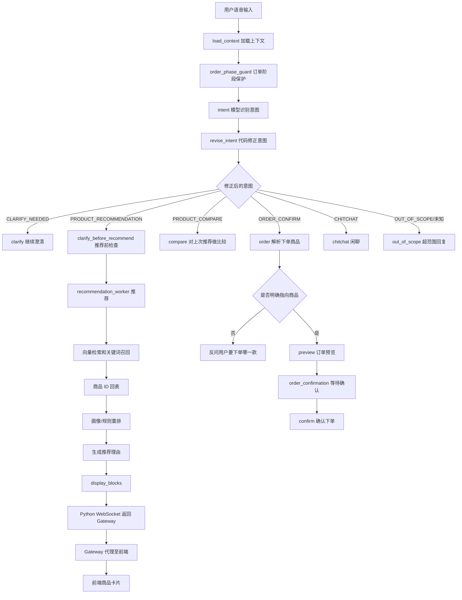

# 语音购物 Agent 推荐与下单流程梳理

本文档整理了当前项目中，用户通过语音表达购物需求后，从信息收集、推荐触发、向量检索、商品卡片生成，到用户表达下单意图时后端图节点如何流转的整体流程。

相关核心代码主要位于：

- `app/graph/supervisor.py`
- `app/graph/handoff.py`
- `app/agents/recommendation.py`
- `app/services/recommend_candidates.py`
- `app/services/vector_search.py`
- `app/services/profile_reranker.py`
- `app/services/recommend_reason.py`
- `app/services/order.py`
- `app/services/order_reference.py`
- `app/graph/execution.py`
- `app/api/routes/voice_ws.py`
- `app/api/routes/chat.py`
- `app/core/gateway_identity.py`

## 接入边界

Python Agent 是 Java 系统的内部服务，不再向浏览器提供静态页面、登录接口或独立鉴权。对外访问统一经过 Java Gateway：

```text
Vue
-> HTTP /agent/**
-> Java Gateway 校验 Sa-Token
-> Java 门面通过 OpenFeign 调用 Python /internal/v1/**

Vue
-> WSS /agent/ws/voice?sessionId=<id>
-> Java Gateway 校验 Sa-Token 并代理 WebSocket
-> Python WS /ws/voice
```

Gateway 会先移除客户端伪造的 `X-Agent-*` 请求头，再为 HTTP 与 WebSocket 握手注入可信的 `X-Agent-User-Id`。Python 只接受这个用户 ID，不解析浏览器令牌；因此 Python 的 `8010` 端口必须仅在内部网络可达。

## 1. 总体主链路

当前后端是一个 LangGraph 风格的状态图。一次用户语音输入进来后，大体会经过这条主链路：

```text
load_context
-> order_phase_guard
-> intent
-> revise_intent
-> business node
-> compliance
-> memory_update
-> finalize
```

其中：

- `load_context`：加载会话上下文，比如历史推荐、阶段、用户画像、上一轮状态等。
- `order_phase_guard`：如果当前正处于订单确认阶段，会优先处理确认、取消等订单相关输入。
- `intent`：由模型判断当前用户意图。
- `revise_intent`：用代码规则对模型意图做确定性修正。
- `business node`：根据修正后的意图进入推荐、澄清、比较、下单、闲聊等业务节点。
- `compliance`：做合规检查或输出约束。
- `memory_update`：更新会话记忆。
- `finalize`：组装最终响应并返回给前端。

可以把 `intent` 看成“模型理解”，把 `revise_intent` 看成“业务兜底路由”。模型可以负责自然语言理解，但关键跳转规则由代码保证可预测。

## 2. 收集足够信息后，如何触发推荐 Worker

语音购物不是用户一说商品就一定马上推荐。系统会先判断信息是否足够。

例如用户说：

```text
我想买个耳机
```

这个需求只有品类，没有预算、场景、品牌等锚点，系统通常会进入澄清节点：

```text
clarification_agent -> clarify
```

前端会继续问：

```text
你主要想用来通勤、运动，还是办公？预算大概多少？
```

当用户继续补充：

```text
通勤用，预算 300 以内
```

此时槽位里已经有：

```text
category = 耳机
scenario = 通勤
budget = 300
```

这时 `revise_intent` 会把原本可能是 `CLARIFY_NEEDED` 的意图修正成 `PRODUCT_RECOMMENDATION`，然后路由到：

```text
clarification_agent -> clarify_before_recommend
```

注意这里不是直接进入 `recommend`。项目里推荐前还有一个 `clarify_before_recommend` 节点，用来做推荐前的最后确认或补槽判断。它确认信息足够后，才会交给真正的推荐 Worker。

## 3. 推荐 Worker 从检索到生成结果的过程

推荐 Worker 的核心流程可以理解为：

```text
用户需求/槽位
-> 构造检索 query
-> 向量检索和关键词召回
-> 得到候选商品 ID
-> 根据 ID 回表读取结构化商品
-> 根据用户画像和规则重排
-> 选择 Top 3
-> 生成推荐理由
-> 组装 display_blocks
-> Python WebSocket 返回 Gateway
-> Gateway 代理 WebSocket 返回前端
-> 前端渲染商品卡片
```

更细一点：

1. 推荐节点拿到当前状态里的 `slots`

   包括品类、预算、场景、品牌、价格方向等信息。

2. 构造检索查询

   例如：

   ```text
   通勤 300以内 蓝牙耳机
   ```

3. 调用候选召回服务

   相关服务通常在：

   ```text
   app/services/recommend_candidates.py
   app/services/vector_search.py
   ```

4. 向量检索

   商品库里不是临时把商品变成向量，而是商品文本在入库或离线阶段已经生成好了 embedding，存放在类似 `product.embedding` 的字段中。

   用户当前需求也会被转成 query embedding，然后用 pgvector 做相似度检索。

5. 检索结果不是直接给前端的文本

   这一点很关键：向量检索出来的通常不是完整商品卡片，而是候选商品 ID 或带有分数的候选记录。

   也就是说：

   ```text
   向量检索结果 = product_id + score
   ```

   而不是：

   ```text
   可以直接展示的商品卡片
   ```

6. 根据商品 ID 回表

   系统会用这些 ID 再去商品表读取完整结构化数据，例如：

   ```text
   name
   brand
   price
   category
   selling_points
   attributes
   stock
   ```

7. 重排

   通过用户画像、预算匹配、场景匹配、品牌偏好等规则进行 rerank。

   相关服务：

   ```text
   app/services/profile_reranker.py
   ```

8. 生成推荐理由

   对 Top 商品生成适合用户当前需求的自然语言推荐理由。

   相关服务：

   ```text
   app/services/recommend_reason.py
   ```

9. 组装推荐结果

   最终会把推荐商品组装成后端状态里的推荐结果，比如 `last_recommendations` 和用于前端展示的 `display_blocks`。

## 4. 文本检索结果如何变成商品卡片

用户问到一个关键点：“通过向量检索检索出来的应该都是文本信息，文本信息变成商品卡片的流程是怎样的？”

在当前项目里，更准确的理解是：

```text
向量检索不是直接返回商品卡片，也不只是返回一段纯文本。
它用文本向量做相似度匹配，但返回的是商品候选记录，核心是商品 ID。
```

完整转换过程是：

```text
商品描述文本
-> 离线生成 product.embedding
-> 用户语音需求生成 query embedding
-> pgvector 相似度检索
-> 得到 product_id 列表
-> ProductRepository 按 ID 回表
-> 得到结构化 ORM 商品对象
-> 转成推荐 dict
-> 加推荐理由
-> 组装 display_blocks
-> Python WebSocket JSON
-> Gateway WebSocket 代理
-> 前端 DOM 商品卡片
```

也就是说，前端卡片不是由“检索文本”直接变出来的，而是由“商品 ID 对应的结构化商品数据”渲染出来的。

一个商品卡片大致需要这些字段：

```json
{
  "rank": 1,
  "name": "某某蓝牙耳机",
  "price": 299,
  "reason": "适合通勤，预算内，续航较好"
}
```

当前前端卡片主要展示：

- 排名
- 商品名
- 推荐理由
- 价格

目前卡片协议里没有明显的图片字段。如果后续要展示商品图，需要后端推荐结果里补充类似：

```json
{
  "image_url": "https://..."
}
```

然后前端卡片渲染逻辑再读取这个字段。

## 5. 用户说“我要下单哪一件商品”时，会走哪些节点

这里要分两种情况。

### 5.1 没有 pending order 的情况

如果当前没有正在确认的订单，用户说：

```text
我要下单哪一件商品
```

这句话本身是模糊的，因为没有说明要下单第几款、哪一个商品名、哪个推荐编号。

大致链路是：

```text
load_context
-> order_phase_guard
-> intent
-> revise_intent
-> order
-> resolve_order_reference(None)
-> compliance
-> memory_update
-> finalize
```

业务含义是：

- `intent` 识别出用户有下单意图。
- `revise_intent` 路由到订单节点。
- `order` 节点尝试解析用户到底指的是哪个推荐商品。
- `resolve_order_reference(None)` 发现没有明确引用。
- 系统会反问用户：你想下单第几款，或者请说明商品名称。

也就是它不会直接下单，而是要求用户明确选择。

### 5.2 明确选择某一款商品

如果用户说：

```text
我要下单第二款
```

这时可以从 `last_recommendations` 里解析出第二个商品。

链路会变成：

```text
load_context
-> order_phase_guard
-> intent
-> revise_intent
-> order
-> resolve_order_reference("第二款")
-> preview
-> order_confirmation
-> interrupt
```

这里的 `interrupt` 表示流程会暂停，等待用户下一轮确认。

系统可能会问：

```text
你确认要下单第二款 xxx 吗？
```

用户下一轮说：

```text
确认
```

则会从订单确认阶段继续：

```text
order_confirmation
-> confirm
-> compliance
-> memory_update
-> finalize
```

### 5.3 一个需要注意的风险

如果已经存在 pending order，当前项目里的确认判断可能会把包含“下单”的话当作确认。

也就是说，如果系统正在等用户确认某个订单，而用户说：

```text
我要下单哪一件商品
```

由于句子里包含“下单”，可能被 `contains_yes()` 一类逻辑误判成确认当前 pending item。

这是一个潜在风险点：订单确认阶段最好区分“确认下单”和“询问下单哪件”。

## 6. `revise_intent` 代码解释

原始代码：

```python
async def revise_intent(state: VoiceShoppingState) -> Command:
    """用上下文确定性修正模型意图，并选择下一业务节点。

    模型擅长理解自然语言，但“便宜点必须基于上次推荐比较”等关键路由由
    代码兜底，保证同一状态得到可预测结果。
    """
    current = state.get("current_intent")
    current_slots = state.get("slots") or {}
    has_last = state.get("phase") == "RECOMMEND" and bool(state.get("last_recommendations"))
    if has_last and current_slots.get("priceDirection") and current in {
        Intent.CLARIFY_NEEDED.value,
        Intent.PRODUCT_RECOMMENDATION.value,
    }:
        current = Intent.PRODUCT_COMPARE.value

    if current == Intent.CLARIFY_NEEDED.value:
        has_category = current_slots.get("category") is not None
        has_anchor = any(current_slots.get(key) is not None for key in ["budget", "scenario", "brand"])
        if has_category and has_anchor:
            current = Intent.PRODUCT_RECOMMENDATION.value
    patch = {"revised_intent": current, "slots": current_slots}
    # target 是交接消息中的业务角色名，goto 是实际 LangGraph 节点名。
    target, goto = {
        Intent.PRODUCT_RECOMMENDATION.value: ("clarification_agent", "clarify_before_recommend"),
        Intent.CLARIFY_NEEDED.value: ("clarification_agent", "clarify"),
        Intent.PRODUCT_COMPARE.value: ("comparison_worker", "compare"),
        Intent.ORDER_CONFIRM.value: ("order_agent", "order"),
        Intent.CHITCHAT.value: ("emotion_agent", "chitchat"),
        Intent.OUT_OF_SCOPE.value: ("emotion_agent", "out_of_scope"),
    }.get(current, ("emotion_agent", "out_of_scope"))
    return handoff_command(
        source="supervisor",
        target=target,
        goto=goto,
        reason=f"route intent {current or 'UNKNOWN'}",
        update=patch,
        payload={"intent": current, "slots": current_slots},
    )
```

这段函数做三件事：

1. 读取模型刚刚识别出来的意图和槽位。
2. 根据上下文用代码修正意图。
3. 根据修正后的意图选择下一个 LangGraph 节点。

### 6.1 读取当前意图和槽位

```python
current = state.get("current_intent")
current_slots = state.get("slots") or {}
```

含义是：

- `current`：模型识别出来的原始意图。
- `current_slots`：模型抽取出来的槽位，比如品类、预算、场景、品牌、价格方向。
- `or {}`：如果 slots 是 `None`，就用空字典，避免后面 `.get()` 报错。

### 6.2 判断是否已有上次推荐结果

```python
has_last = state.get("phase") == "RECOMMEND" and bool(state.get("last_recommendations"))
```

只有同时满足两个条件才算有上次推荐：

- 当前会话阶段是 `RECOMMEND`
- `last_recommendations` 不为空

也就是说，系统必须真的已经推荐过商品。

### 6.3 “便宜点”这种话强制转成比较

```python
if has_last and current_slots.get("priceDirection") and current in {
    Intent.CLARIFY_NEEDED.value,
    Intent.PRODUCT_RECOMMENDATION.value,
}:
    current = Intent.PRODUCT_COMPARE.value
```

例如用户上一轮已经看到了 3 个推荐商品，然后说：

```text
有没有便宜点的？
```

模型可能会把它识别为：

```text
CLARIFY_NEEDED
```

或者：

```text
PRODUCT_RECOMMENDATION
```

但业务上，“便宜点”必须基于上次推荐商品做比较，所以代码强制改成：

```text
PRODUCT_COMPARE
```

这样就会走：

```text
comparison_worker -> compare
```

### 6.4 信息已经够了，就从澄清改成推荐

```python
if current == Intent.CLARIFY_NEEDED.value:
    has_category = current_slots.get("category") is not None
    has_anchor = any(current_slots.get(key) is not None for key in ["budget", "scenario", "brand"])
    if has_category and has_anchor:
        current = Intent.PRODUCT_RECOMMENDATION.value
```

如果模型觉得还要澄清，但代码发现已经有足够推荐的信息，就会改成推荐。

足够信息的判断是：

```text
有 category
并且 budget / scenario / brand 至少有一个
```

例如：

```text
category = 耳机
budget = 300
```

这就可以推荐，不需要继续问。

## 7. 路由字典解释

用户重点问到这段：

```python
target, goto = {
    Intent.PRODUCT_RECOMMENDATION.value: (
        "clarification_agent",
        "clarify_before_recommend",
    ),
    Intent.CLARIFY_NEEDED.value: (
        "clarification_agent",
        "clarify",
    ),
    Intent.PRODUCT_COMPARE.value: (
        "comparison_worker",
        "compare",
    ),
    Intent.ORDER_CONFIRM.value: (
        "order_agent",
        "order",
    ),
    Intent.CHITCHAT.value: (
        "emotion_agent",
        "chitchat",
    ),
    Intent.OUT_OF_SCOPE.value: (
        "emotion_agent",
        "out_of_scope",
    ),
}.get(
    current,
    ("emotion_agent", "out_of_scope"),
)
```

这其实是一个“意图到节点”的映射表。

可以拆成更好理解的写法：

```python
routes = {
    Intent.PRODUCT_RECOMMENDATION.value: ("clarification_agent", "clarify_before_recommend"),
    Intent.CLARIFY_NEEDED.value: ("clarification_agent", "clarify"),
    Intent.PRODUCT_COMPARE.value: ("comparison_worker", "compare"),
    Intent.ORDER_CONFIRM.value: ("order_agent", "order"),
    Intent.CHITCHAT.value: ("emotion_agent", "chitchat"),
    Intent.OUT_OF_SCOPE.value: ("emotion_agent", "out_of_scope"),
}

target, goto = routes.get(
    current,
    ("emotion_agent", "out_of_scope"),
)
```

它的含义是：

```text
如果 current 是 PRODUCT_RECOMMENDATION
就得到 ("clarification_agent", "clarify_before_recommend")

如果 current 是 ORDER_CONFIRM
就得到 ("order_agent", "order")

如果 current 没匹配上
就默认得到 ("emotion_agent", "out_of_scope")
```

### 7.1 `target` 和 `goto` 的区别

`target` 是交接消息里的业务角色名，用于记录“交给谁”。

例如：

```text
order_agent
comparison_worker
clarification_agent
```

`goto` 是真正的 LangGraph 节点名，用于决定程序下一步跳到哪里。

例如：

```text
order
compare
clarify
clarify_before_recommend
```

所以这句：

```python
target, goto = ("order_agent", "order")
```

等价于：

```python
target = "order_agent"
goto = "order"
```

### 7.2 `.get(current, default)` 是什么意思

Python 字典的 `.get()` 方法表示：

```python
dict.get(key, default)
```

含义是：

- 如果 `key` 存在，返回对应 value。
- 如果 `key` 不存在，返回 `default`。

所以：

```python
{
    Intent.ORDER_CONFIRM.value: ("order_agent", "order")
}.get(
    current,
    ("emotion_agent", "out_of_scope"),
)
```

如果：

```python
current = Intent.ORDER_CONFIRM.value
```

得到：

```python
("order_agent", "order")
```

然后拆包：

```python
target = "order_agent"
goto = "order"
```

如果：

```python
current = "UNKNOWN"
```

没有匹配项，就得到默认值：

```python
("emotion_agent", "out_of_scope")
```

然后：

```python
target = "emotion_agent"
goto = "out_of_scope"
```

### 7.3 为什么推荐意图先去 `clarify_before_recommend`

这行容易误解：

```python
Intent.PRODUCT_RECOMMENDATION.value: (
    "clarification_agent",
    "clarify_before_recommend",
)
```

意思不是“推荐交给澄清 Agent 完成”，而是：

```text
推荐前先进入澄清 Agent 的 clarify_before_recommend 节点，
由它判断信息是否足够，足够后再进入真正推荐流程。
```

这个节点像一个推荐前的关口。

## 8. `handoff_command` 的作用

最后这段：

```python
return handoff_command(
    source="supervisor",
    target=target,
    goto=goto,
    reason=f"route intent {current or 'UNKNOWN'}",
    update=patch,
    payload={"intent": current, "slots": current_slots},
)
```

含义是：Supervisor 把控制权交给下一个业务节点。

其中：

- `source="supervisor"`：说明是 Supervisor 发起交接。
- `target=target`：记录交接给哪个业务角色。
- `goto=goto`：真正跳转到哪个 LangGraph 节点。
- `reason=...`：记录为什么跳转。
- `update=patch`：更新图状态，比如写入 `revised_intent`。
- `payload=...`：把意图和槽位作为交接信息带过去。

可以理解为：

```text
Supervisor 判断完路线后，把状态和交接说明打包，然后让 LangGraph 跳到 goto 指定的节点。
```

## 9. 一张总流程图



## 10. 最关键的理解

这个项目里最重要的几个点是：

- 推荐不是一上来就发生，而是要先收集到足够槽位。
- 模型识别意图之后，还会经过 `revise_intent` 做代码级修正。
- 向量检索用的是商品文本 embedding，但检索结果核心是商品 ID。
- 商品卡片来自商品 ID 回表后的结构化商品数据，不是直接由检索文本渲染出来的。
- 用户下单时，订单节点会先解析用户指的是哪一个推荐商品。
- 明确说“第二款”可以进入订单预览和确认；没说清楚则会反问。
- `target` 用于交接记录，`goto` 才是真正的图节点跳转目标。
